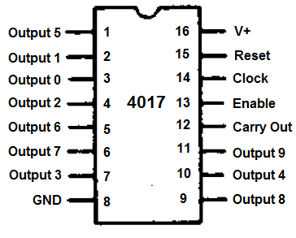

# sesion-05b

viernes 10 de abril

## Chip 4017

funciona como un contador de décadas, su función principal es recibir pulsos eléctricos y distribuirlos de forma secuencial a través de sus 10 salidas

### Cómo funcionan las patitas

- Clock Inhibit / Enable (patita 13): permite pausar el contador, si está activado entonces el chip ignora los pulsos del clock
- Clock (patita 14): entrada de ritmo, cada vez que recibe un pulso (por ejemplo desde un 4093 que ya hemos visto) el contador avanza un paso
- Reset (patita 15): si esta patita recibe energía, el contador vuelve inmediatamente al primer paso (Q0), sin importar en cuál iba
- Outputs (Q0 - Q9): son las 10 salidas, solo una está activa a la vez, no están en orden según el número de la patita, es mejor revisarlo en una gráfica como esta:

En el caso de sintetizadores, el 4017 se utiliza para crear secuenciadores de pasos:

Ritmo: un oscilador (chip 4093) envía un pulso constante a la patita clock

Activación: el 4017 activa una salida a la vez

Control: cada salida se conecta a un potenciómetro que define una nota o volumen diferente

### Esquemático para ambos chips 

