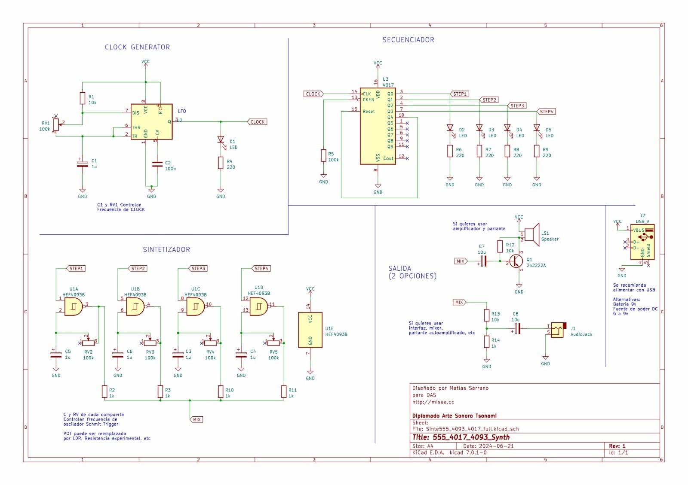

# sesion-06a

martes 14 de abril

## Clase

empezamos ya a armar el sintetizador, utilizaremos 4 chips: 555, 4017, 4093 y 386

estamos usando este esquemático, somos 3 asi que dividimos en hacer cada una un chip y al final la conexión con el parlante

entre el 555 y el 4017 funciona bien, tuvimos un error y fue que las patitas del potenciómetro en el 555 no estaban bien conectadas (estaba al revés y lo hacia confuso)

aaron nos dijo que lo mejor era tratar de ir armando según el orden del esquemático, es decir si el potenciómetro está al lado izquierdo del chip es más fácil de armar y leer si en físico está de la misma forma

también nos ocurrió que el segundo led (step 2) no encendia, probé cambiar la resistencia, el cable, el led y nada, hasta que pensé que el chip podria tener mala la patita 2 (Q1), así que lo cambié y efectivamente justo esa patita estaba mala :( 

### Gif de ambos chip funcionando correctamente (555 y 4017)

teniamos dudas para armar el 4093 por falta de materiales, no nos alcanzaban las protoboard, así que compraremos 2 grandes para el proyecto-01 y continuaremos en la clase del viernes
