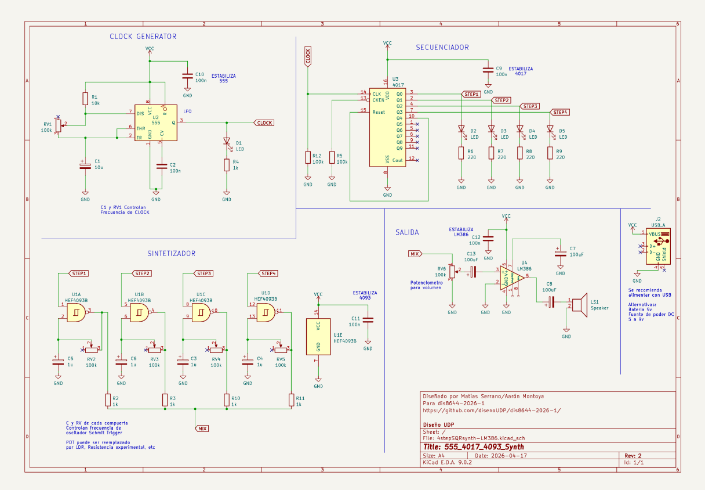
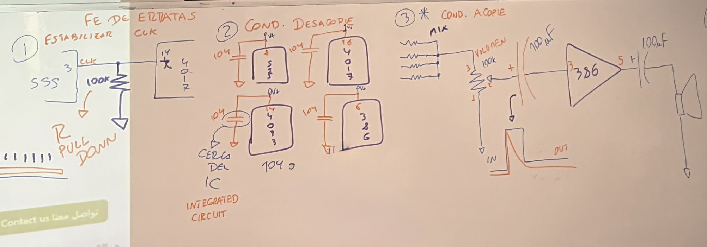

# sesion-06b

viernes 17 de abril

## Clase

esquemático del sintetizador actualizado:

ahora debemos agregar una lentejita de 100nf en cada patita que va a vcc, en cada chip

foto de la pizarra explicándolo: 

ya tenemos las protoboard grandes asi que lo podemos armar, empezamos de 0

a considerar:

- GND: cables café, verde o negro
- VCC: cables rojo, amarillo o naranjo
- LEDS: si es posible que cada uno vaya con un cable acorde al color del led, y también si desde ahí mismo sale otro cable que también siga el color (nos sirve en los steps para identificarlos más fácil)

chip 555 y 4017 funcionando correctamente, logramos armar el 4093 y el 386 pero no nos funciona el parlante

misa nos ayudó a probar por separado el 4093 con un solo potenciómetro y el 386, teniamos mal conectado los condensadores en el 386

considerar quitar uno de los leds ya que eso también podia ser una razón por la cual no funcione

a pesar de modificar eso al volver al proyecto armado el parlante no emite sonido :(

### Proyecto armado

(aún no funcionando con parlante)

