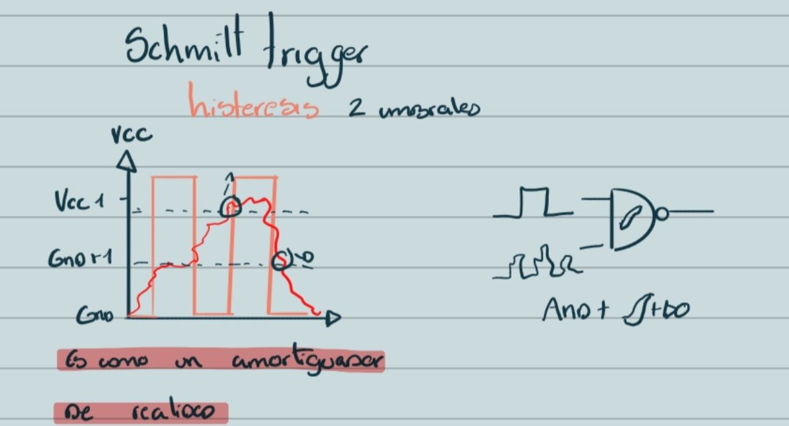
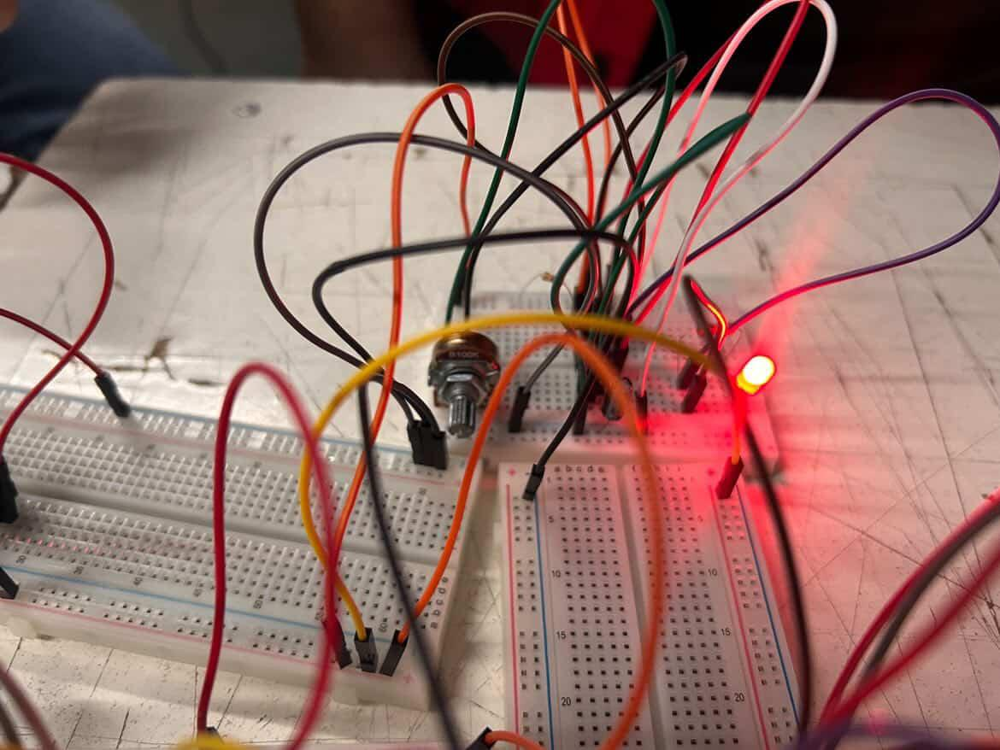
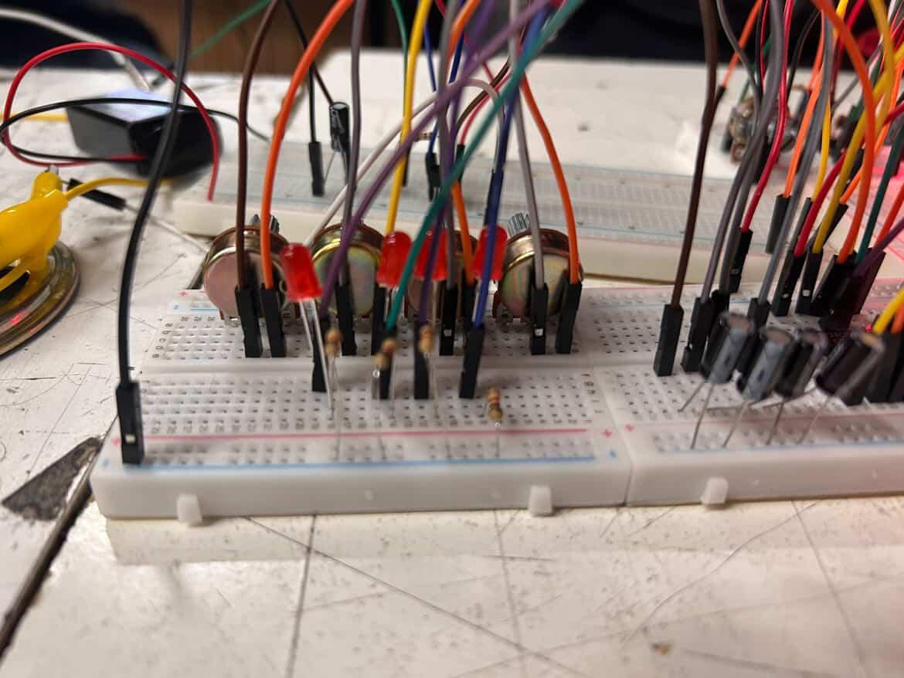
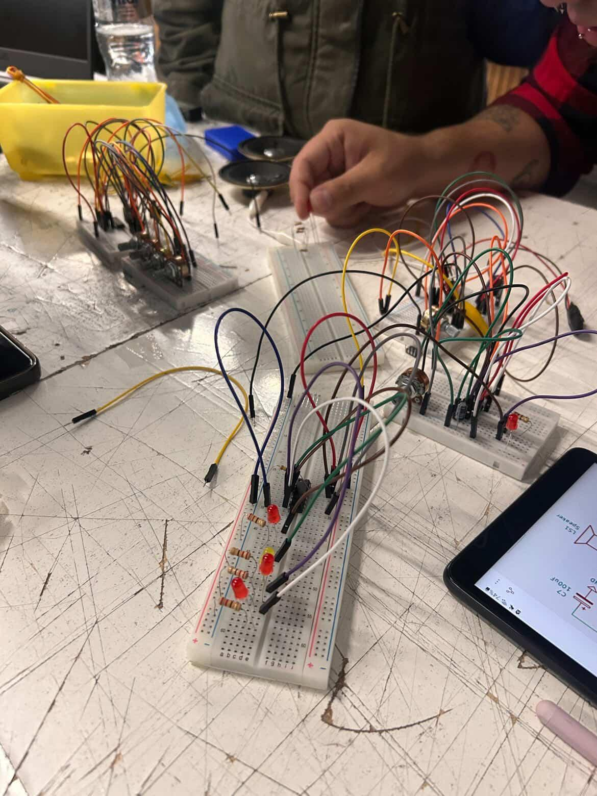
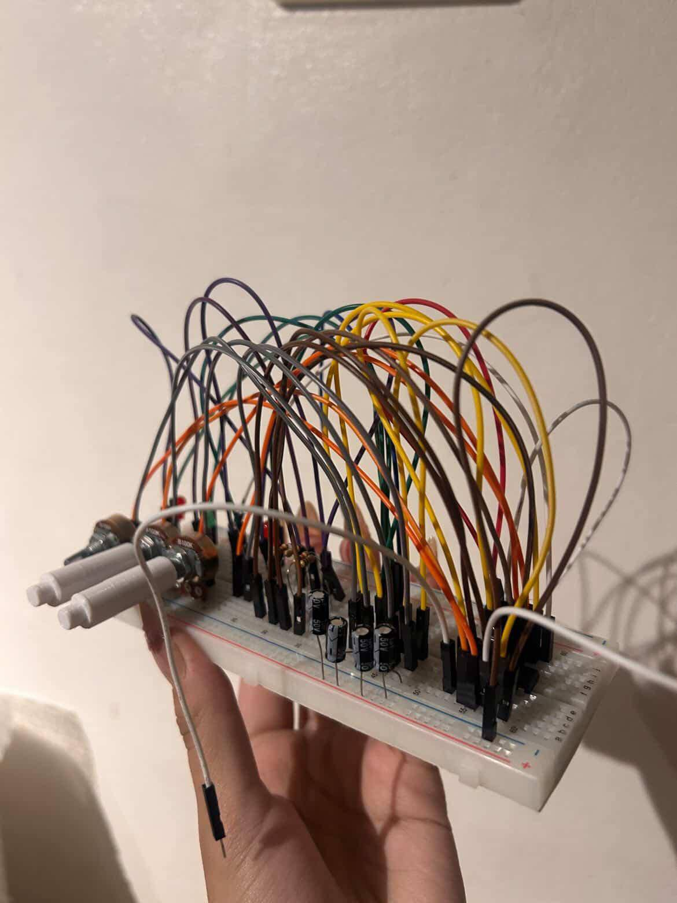
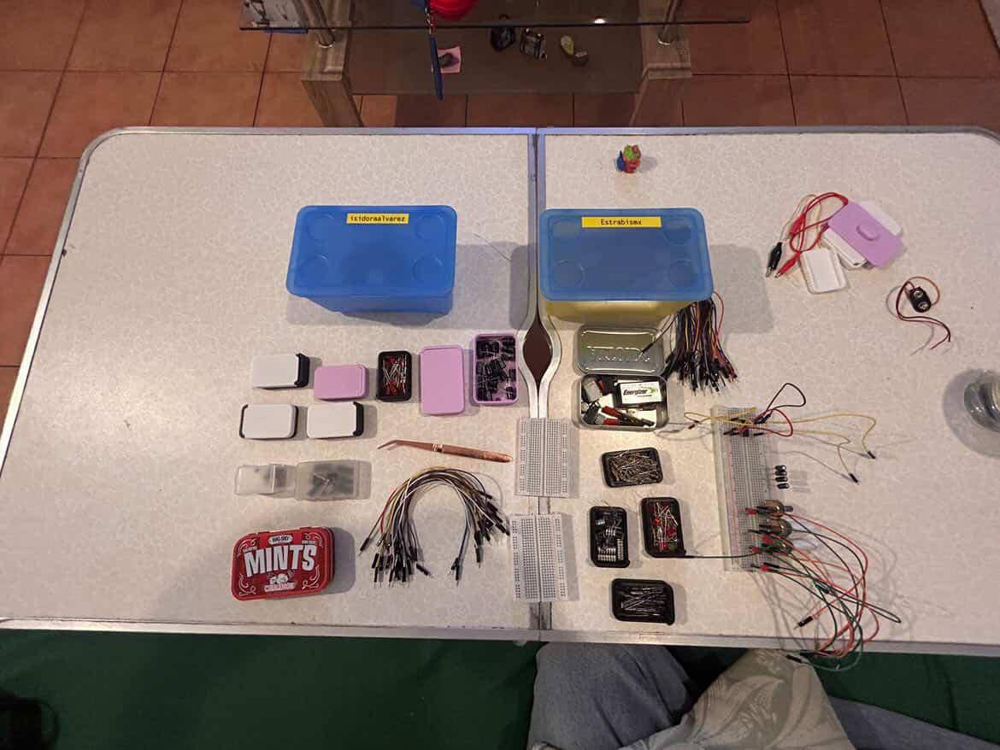
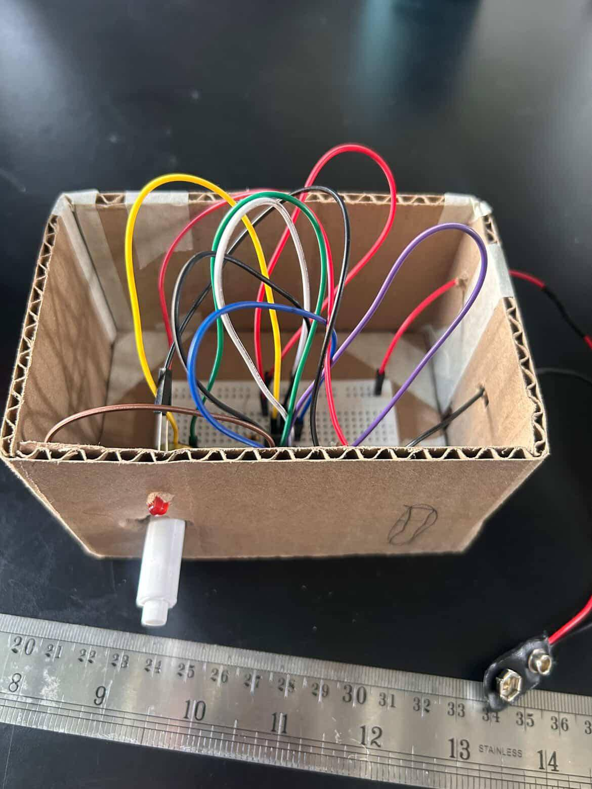

# sesion-06a

## **REFERENTES**

-aesthetic programic: manual de estudios de software
-Pandoc:conversor de documentos libre y de código abierto, mayormente usado como una herramienta de escritura
-resumen temple: plantillas curriculum 

## **DISPARADOR SCHMITT**

convierte una señal ruidosa o inestable en una señal digital limpia usando dos niveles de activación.
En un Schmitt, la histéresis es la separación entre el nivel de encendido y el de apagado.

## **CD 4000 FAMILY** 

-CD 4000: Familia de circuitos integrados CMOS de propósito general: bajo consumo, amplio rango de alimentación, y alta inmunidad al ruido.

-CD 4069: Osciladores, generación de señales, adaptación de niveles

-CD 4020:  Temporizadores, divisores de frecuencia

-CD 4017:  Contador de décadas con 10 salidas,Secuencias, luces LED, control por pasos

-CD 4093:  Contiene 4 compuertas NAND con Schimitt Trigger

-CD 4011:  Circuitos digitales básicos

-CD 4026:  Contadores visibles (0–9), relojes simples

-CD 4013:  Memoria, división de frecuencia, sincronización

-CD 4066:  Conmutación, multiplexación de señales

## **SINTETIZADOR**

Inicio proyecto grupal

CD 555-386-4093-4017

## **PROCESO EN CLASES DE PROYECTO**

Al inicio el 555 (astable) y el secuenciador 4017 daban señales de vida, pero luego en la segunda parte, estos dejarán de funcionar,el Sintetizador 4093 y la salida 386.

tuvimos farias fallas, como que e chip 555 se murio como dos vece, en el circuito 4017 habia una luz que no prendria, pero era por que el led estaba quemado, tambien habia cables mal conectados que impidian que funcionara el circuito

**Despues de clases**

Cada una empezo a practicar y ver los circuitos, para llevarlo avanzado, yo aparte empece a ver el cd 4093 que me estaba costando mas entenderlo, de como iba funcionando.
me costo mucho como ver de que patita salia el cable a las led y potenciometros.
Ahora logre entenderlo mejor, pero me sigue costando ya que son muchos cables y componentes, y para entenderlo bien necesito ir en orden y siguiendo paso a paso todo.

( P.D:si me di cuenta que algunos capacitores estaban conectados en positivo, se cambio antes de que se conectara la bateria, no exploto nada:))

(tenia que tener todo ordenador,los cables separado por colores, para poder entender y realizar todo bien)

**De manera grupal**

Empezamos a ver como hariamos un Sintetizador Modular que debiamos encapsularlo en una caja de carton, se llego a un acuerdo como grupo que cada circuito tuviera su propio contenedor, para logra que el trabajo tenga un mayor ofcio, este se cortaria en laser.

**Primeros acercamientos**

Primero se modelo en rhino 

y posteriormente se para por una ia, la cual se les dio las indicaciones para logra el render realista

**PRIMER PROTOTIPO**

Se hizo el primer prototipo a mano antes de mandarlo a cortar en laser, para ver si lo que teniamos en mente se podria concretar.

Se logro llegar a lo que queriamos, pero de igual manera fuimos haciendo modificaciones sobre la marcha, fuimos mejorando detalles y agregando cosas para mejorar el oficio y una mejor experiencia.
(detalles que se vera el dia de la presentacion ;))

