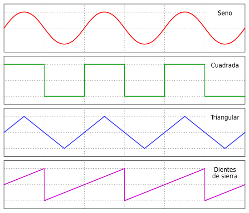
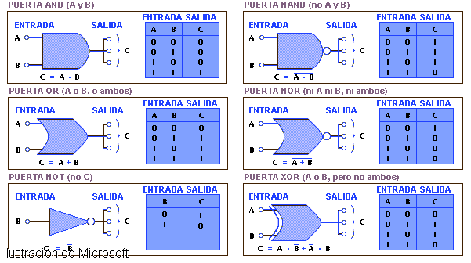

# sesión-05a

## VCV Rack

Es una plataforma online donde podemos crear sintetizadores modulares de forma gratuita, basada en el formato Eurorack.

Los inputs y outputs tienen un borde negro, lo que indica que son puntos de entrada o salida de señal.

El gate funciona como una compuerta que permite o bloquea el paso del sonido.

## Palabras clave

- VC (Voltage Controlled) controlado por voltaje.

- VCO (Voltage Controlled Oscillator) oscilador controlado por voltaje.

- LFO (Low Frequency Oscillator) oscilador de baja frecuencia que no se usa para generar sonido directamente, sino para modular parámetros.

- VCA (Voltage Controlled Amplifier) controla y regula el volumen.

- VCF (Voltage Controlled Filter) modifica el timbre armónico de la señal de audio.

## Ondas de sonido

- Senoidal: Curva suave y fluida. Suena limpia, sin armónicos, solo con la frecuencia fundamental.

- Triangular: Sube y baja de forma simétrica. Suena suave, pero más rica que la senoidal. Tiene armónicos impares que pierden fuerza rápidamente.

- Cuadrada: Alterna instantáneamente entre valores máximos y mínimos. Suena “hueca”, similar a videojuegos clásicos. Tiene armónicos impares más presentes que la triangular.

- Sierra (saw): Sube en rampa y cae bruscamente. Es más intensa y contiene todos los armónicos, por lo que se usa para imitar instrumentos como cuerdas o metales.

## Álgebra de Boole

En electrónica digital, los valores 0 y 1 representan estados (por ejemplo, tierra y 9V).

Las compuertas lógicas como NOT (inversor) y AND son fundamentales para procesar señales binarias dentro de los circuitos y microchips. Son la base de la electrónica digital, donde AND, OR y NOT son las básicas, complementadas por NAND, NOR, XOR y XNOR, esenciales para el diseño de sistemas computacionales.

## Ejercicio en clase: chip 4093 y LM386

Junto a Anays Cornejo, construimos un amplificador de sonido.

Primero utilizamos un potenciómetro y luego probamos con dos.

### Un potenciómetro

https://github.com/user-attachments/assets/d2ce1d8e-45e1-4622-b72d-d0a0dd475233

### Doble potenciómetro

https://github.com/user-attachments/assets/2bbdde3e-94cc-4182-a0ea-fdfef8664d0b

En la versión con doble potenciómetro, notamos que el sonido se parecía mucho a Poker Face de Lady Gaga.

https://github.com/user-attachments/assets/b95852d9-8988-4afd-86c6-a97173941883
