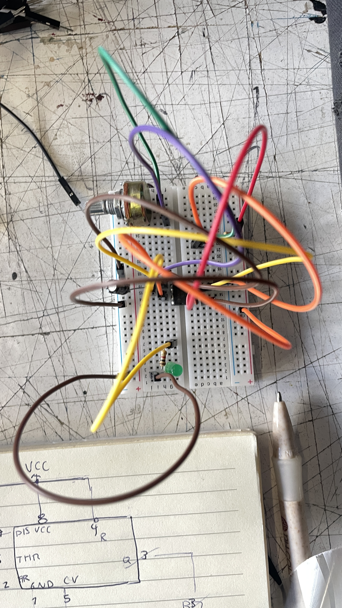
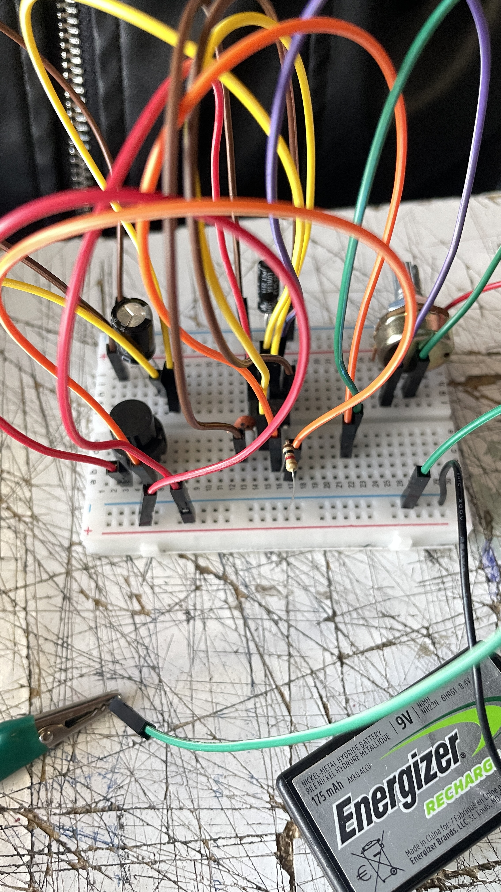
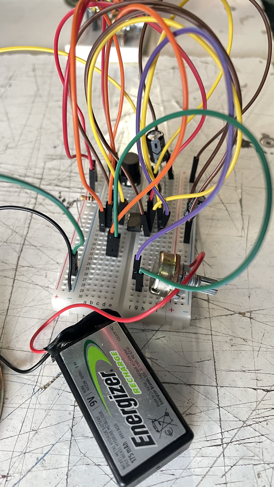
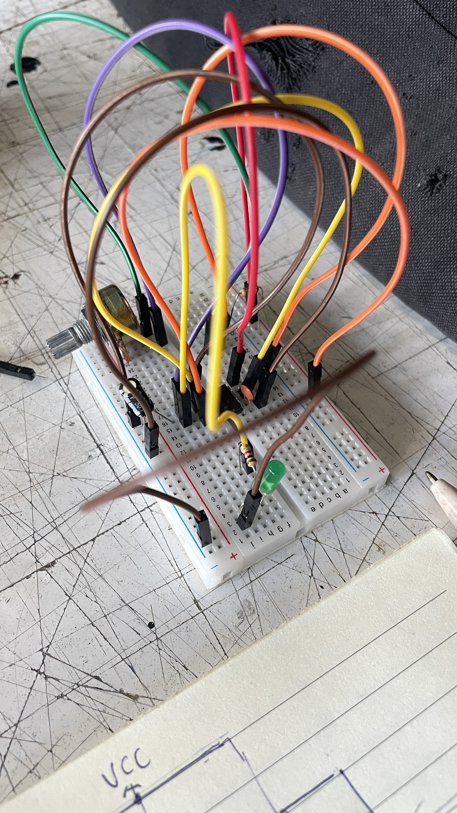

# sesion-03a  
24 de Marzo

Recomendación: Editorial matar Chile  

**Los multivibradores astables y monoestables son circuitos generadores de pulsos, comúnmente basados en el _Chip integrado 555_.**

### Multivibrador Astable: 

Oscilador de libre funcionamiento sin estados estables, generando una onda cuadrada continua (reloj).

- **Funcionamiento:** no tiene estados estables. Alterna automáticamente entre "alto" y "bajo" continuamente, funcionando como oscilador.
- **Salida:** onda cuadrada o rectangular (tren de pulsos).
- **Componentes:** determinado por dos resistencias (R1, R2) y un capacitor (C1) para la frecuencia y el ciclo de trabajo.
- **Ej de aplicacion:** luces LED intermitentes

### Multivibrador Monoestable:
 
Tiene un único estado estable y produce un solo pulso de duración definida tras un disparo externo (temporizador).

- **Funcionamiento:** Posee un solo estado estable (generalmente en reposo o "bajo"). Al recibir un pulso externo, cambia al estado "alto" durante un tiempo específico y regresa automáticamente al estable.
- **Salida:** Un único pulso de duración predeterminada.
- **Componentes:** El tiempo del pulso está determinado por una resistencia (R) y un capacitor (C).
- **Ej de aplicacion:** temporizadores.

videos explicativos: 

- [video 1](https://www.google.com/search?sca_esv=e701aa2a750b70d5&rlz=1C5CHFA_enCL884CL884&sxsrf=ANbL-n6d5KUAaT5vso4jtzNiz_5s6BB6cQ:1775254370085&q=astable+monoestable&source=lnms&fbs=ADc_l-Z2hWAAkBmTP82hVZiVsf_aB0R8OETo07r27nNcwnogIyRLslmNBLttnosEf9Shs3VyjeVE3ZV1aQeJeDqRGPbA6Y6FtyudVBvbNrkBAl3jtkBAl5IZqOLwV-JJvr8noajnjKHNBN3kBQRF0zYW0W_OypIfC5ETyEZmgQnuti68d02WVoXgHm1CaWA6VjVfnEaLdHk0P939Y3pezDWBK2hZP6RG72jt8k979F7q-0aDiucoHeo&sa=X&ved=2ahUKEwiJq_Xw2dKTAxVHgWEGHbwfKF4Q0pQJegQICxAB&biw=1381&bih=701&dpr=1#fpstate=ive&vld=cid:8df119ec,vid:fjkZFDpk5Yc,st:74)

- [video 2](https://www.google.com/search?sca_esv=e701aa2a750b70d5&rlz=1C5CHFA_enCL884CL884&sxsrf=ANbL-n6d5KUAaT5vso4jtzNiz_5s6BB6cQ:1775254370085&q=astable+monoestable&source=lnms&fbs=ADc_l-Z2hWAAkBmTP82hVZiVsf_aB0R8OETo07r27nNcwnogIyRLslmNBLttnosEf9Shs3VyjeVE3ZV1aQeJeDqRGPbA6Y6FtyudVBvbNrkBAl3jtkBAl5IZqOLwV-JJvr8noajnjKHNBN3kBQRF0zYW0W_OypIfC5ETyEZmgQnuti68d02WVoXgHm1CaWA6VjVfnEaLdHk0P939Y3pezDWBK2hZP6RG72jt8k979F7q-0aDiucoHeo&sa=X&ved=2ahUKEwiJq_Xw2dKTAxVHgWEGHbwfKF4Q0pQJegQICxAB&biw=1381&bih=701&dpr=1#fpstate=ive&vld=cid:ac400ae3,vid:-Nz1XN2rPxw,st:8)

---------------------------------------------------------

### Otras definiciones

+ Amor: falta de muerte
  
+ Contreras: contrario 
( :0 )

--------------------------------------------------------

### Frecuencia:** cada cuánto pasa algo (suceso y tiempo).
El tiempo que hay mientras se repite un ciclo es una onda. Ese tiempo es el que se llama **periodo**, ese periodo **define una onda**.

**Ejemplos de periodos importantes:**
- día (la tierra gira, 24 horas)
- ingesta de remedios(tomar pastilla, 8 horas)

**Fórmula de frecuencia (*f*):**

Frecuencia (general/tiempo):  *f*= 1/T'

-> Donde *f* es frecuencia en Hertz (Hz) y *t* es el periodo o tiempo de un ciclo. **Mide cuántos eventos ocurren en un tiempo definido.**

(**Tiempo total / número de oscilaciones**)

**Fórmula período (*T*):**

T= *t*/*n* 

-> Donde *t* es el tiempo total y *n* es el número de ciclos o revoluciones. **También se calcula como el inverso de la frecuencia**.

***Si aumenta la frecuencia, el período disminuye  
Si disminuye la frecuencia, el período aumenta***

*revisar estos apuntes… (los escribi a la rapida)

- Si C se hace más grande, la frecuencia baja.   
- A sube, T baja. (cambiado más adelante por frecuencia <-> período)  
- RV resistencia 7/6 mayor a 1kg  
- ~~la oscilación no ocurre en el led~~, se manifiesta, ocurre en la patita  
- oscilación puede ocurrir en cualquier frecuencia  
- voltaje 9V

## Corrección:

### Sobre el circuito

1. **Si C se hace más grande, la frecuencia baja.**
   Un condensador (con números) más grande tarda más en cargarse/descargarse -> ciclos más lentos -> menor *frecuencia (f)*.

3. **Resistencia variable (RV)**
- Controla la frecuencia junto con el condensador  
- Mayor resistencia -> carga más lenta -> menor *frecuencia (f)*.

Preguntar por:

7/6 probablemente es la conexión entre pines (parece que son patitas del 555) mayor a 1kΩ (para evitar exceso de corriente).

RV resistencia 7/6

### Sobre la oscilación

**Correcióon:**

- La oscilación ocurre en la salida del circuito (pin del 555)
- - El LED solo muestra esa oscilación (parpadea)
  
***La señal actúa y LED es como la pantalla***

### Resumen  
(me ayudó chatgepete)

𝑓=1/𝑇  
f=1/T  
𝑇=1/𝑓  
T=1/f  
𝑇=𝑡/𝑛  
T=t/n  
Frecuencia = ciclos por segundo  
Período = duración de un ciclo  
↑ C → ↓ frecuencia  
↑ R → ↓ frecuencia  
La oscilación ocurre en la salida del circuito, no en el LED.  
El LED solo indica la señal.  
Alimentación: 9V  

https://github.com/user-attachments/assets/e52c2c0e-a455-45af-9df3-c13fee9c05eb

Fuente: [@bunibunirabit](https://www.instagram.com/p/DRxh0mKjJ2Y/) en instagram

### Ejercicio en clases

**Esquema** 

 

Ejercicio realizado en mi protoboard (no resultó) y en la de mi compañera Catalina O (a ella si) ups

  
# Segundo bloque

### Referentes:

## John Cage 

John Cage (1912–1992) fue un compositor, teórico musical y artista visual estadounidense. Su **exploración del azar, el silencio y el sonido cotidiano transformó las nociones tradicionales de música y composición, influyendo profundamente en generaciones posteriores de músicos y artistas conceptuales**.
Influenciado por el budismo zen y la filosofía oriental, Cage concebía la música como una forma de atención plena al entorno sonoro. Su célebre frase “no existe el silencio” resume su idea de que cualquier sonido puede ser música. La obra 4′33″, en la que el intérprete no ejecuta notas, ejemplifica este principio y se convirtió en un ícono del arte conceptual del siglo XX.

fuentes: [John Cage Trust](https://johncage.org/), [John Cage - Percussive Arts Society](https://pas.org/john-cage/) 

performance: [John Cage 4’33 - "Everything we do is music”](https://www.youtube.com/watch?v=TOgrWX5_dS4)

**Comentario que rescaté del video (@Warlesc):**
> Se dice comúnmente que John Cage introduce la noción de silencio, pero en realidad este silencio en la interpretación, fomenta la escucha atenta por parte de los espectadores, de los micro acontecimientos sonoros que se producen en la sala durante 4'33'' que dura el concierto. Cage es el introductor de la escucha activa, influenciado por las enseñanzas de las filosofías orientales propuestas por el maestro Zen D.T. Suzuki. Su silencio amplía la percepción sonora y **cambia el foco de atención de la música occidental hacia los sonidos no intencionados**.

***Experimento del silencio***
Este experimento (realizado en 1951) consistió en entrar a una cámara anecoica en la Universidad de Harvard para buscar el silencio absoluto. Al escuchar su sistema nervioso (zumbido agudo) y sanguíneo (sonido grave), concluyó que el silencio no existe. Esta revelación inspiró su obra 4′33″ (1952), enfocada en los sonidos ambientales.

incluso en una sala aislante de ruido y él aguantando la respiración, no logró alcanzar el silencio absoluto. Concluyendo que el silencio no existe, sino que es un constructo.

fuente: [Irina Mishina](https://irinamishina.com/es/2013/09/23/como-john-cage-descubri-que-el-silencio-no-existe/#:~:text=En%201951%20John%20Cage%2C%20uno,sonidos%20que%20nos%20pueden%20rodear.)

## David Tudor:
David Tudor (1926–1996) fue un pianista y compositor estadounidense, ampliamente reconocido por su papel pionero en la interpretación de música experimental y en el desarrollo de la música electrónica en vivo. Su colaboración con **John Cage** (frends bffs) definió una era en la música contemporánea del siglo XX. A partir de los años sesenta, Tudor dejó de ser principalmente intérprete para dedicarse a la creación de sistemas sonoros y circuitos electrónicos que funcionaban como instrumentos en sí mismos. Ha sido posicionado como precursor de la performance electrónica en vivo y del uso escultórico del sonido.

fuente: su [página de wikipedia](https://es.wikipedia.org/wiki/David_Tudor)

Video de **Steim Slaapkamer Muziek (16/06/1994)**
[video](https://www.youtube.com/watch?v=Fo30MgBRQO0)

Matt (no anoté el apellido...) oscilador victoriano (macumbista)

---------------------------------------------------------------

### Funcionamiento sintetizador:

**Moog:**

+ r - atenua
+ c - filtra

**VCC:** voltaje de alimentación directa

### Interruptor:

+ hago algo -> se prende
+ no hago nada -> se apaga

Puede ser momentáneo o perdurar en el tiempo.

### Capacitor: **detectar solamente las diferencias  
(ej: leer las noticias de hoy).

Capacitor - Inductor (hace lo contrario, no lo vamos a ver en el curso).  

  

## Anexo: Componentes electrónicos y símbolos

  
Fuente: [Post de Facebook (Aprendo Inge)](https://www.facebook.com/Aprendoinge/posts/conoce-algunos-de-los-componentes-electr%C3%B3nicos-mas-populares-y-sus-s%C3%ADmbolos/747408897606357/)

jejeje  
  
Fuente: [Post de Instagram (HammerSpider)](https://www.instagram.com/p/DVHBgqOEhBk/)

