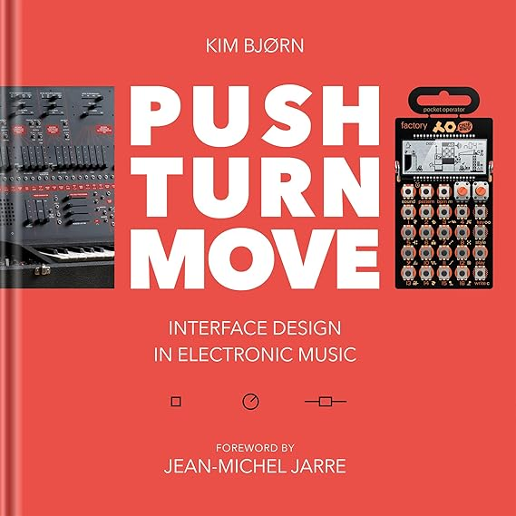
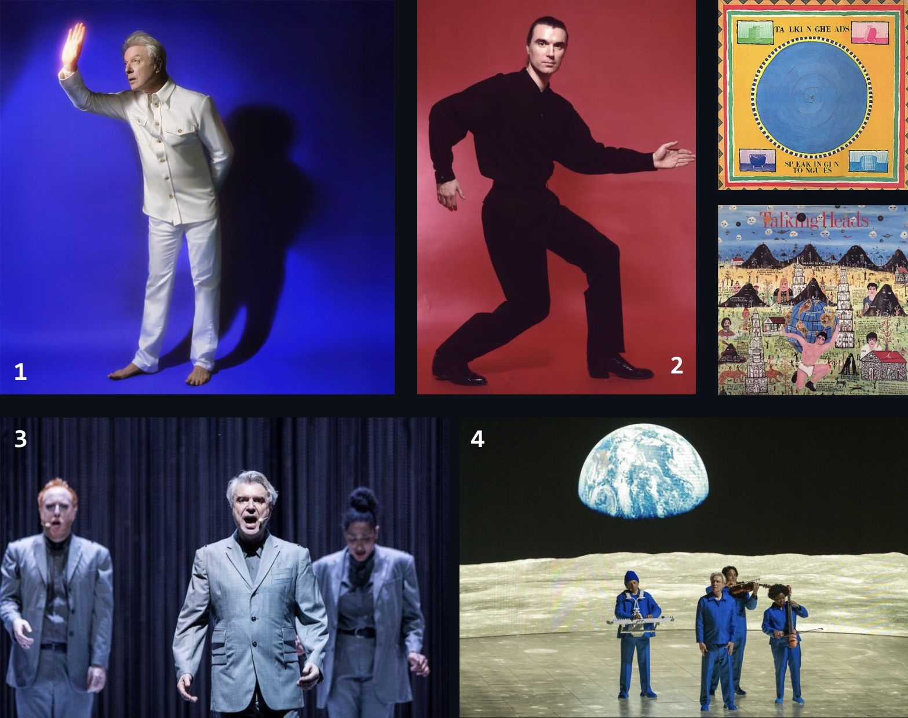

# sesion-05b
10 de Abril 

### Recomendación:
- **Push turn move (Kim Bjørn)**: libro sobre instrumentos musicales electrónicos.
El libro celebra el arte y la ciencia detrás del **diseño de interfaz** en la música electrónica explorando el mundo funcional, artístico, filosófico y estético contenido en la misteriosa conexión entre intérprete y máquina.

  

Descripción y fotos de [Stratgear](https://stratgear.com/es/produto/push-turn-move/)
*uhhhh*

### Rererentes:

## David Byrne  
Músico detrás de Talking Heads, nació en Escocia (1952) pero emigró a EE. UU. cuando niño. Es reconocido por su excentricidad artística y por ser un artista polifacético, es: músico, cineasta, escritor y fundador del sello *Luaka Bop*. Famoso por usar un "traje grande" ("*Big Suit*" para la película *Stop Making Sense* de 1984) para cambiar sus proporciones y autodescribirse con **tendencias autistas**🔥🔥 que considera un superpoder creativo.

Discución de David Byne y Autismo en [Reddit](https://www.reddit.com/r/talkingheads/comments/17h8if5/how_certain_is_it_that_david_byrne_is_on_the/)

**[Luaka Bop](https://luaka-bop.myshopify.com/)**

 

Fuente: [Wikipedia](https://en.wikipedia.org/wiki/Luaka_Bop)

Fuente: su [página de Wikipedia](https://es.wikipedia.org/wiki/David_Byrne#:~:text=Para%20el%20pol%C3%ADtico%2C%20v%C3%A9ase%20David%20Byrne%20(pol%C3%ADtico).,de%20colaborar%20con%20multitud%20de%20otros%20artistas.)

Presentaciones en vivo lol:
- [David Byrne en "Martes 13" de Canal 13 (1990)](https://www.youtube.com/watch?v=7JV6yHFamcg&t=10s)  
- [David Byrne en vivo en Coachella 2026](https://www.youtube.com/watch?v=Kn1vsMJk260&list=RDKn1vsMJk260&start_radio=1)

**DB: David Byrne**

1. DB en su promoción del álbum *Who is the Sky?* y su gira mundial correspondiente de 2026. ([link](https://www.rockaxis.com/vanguardia/noticia/47788/-who-is-the-sky--david-byrne-presenta-su-nuevo-album-de-estudio/))  
2. DB en 1987. Jack Mitchell/Getty Images. ([link](https://www.insidehook.com/style/understated-menswear-lessons-david-byrne))  
3. DB durante su gira mundial y espectáculo de Broadway "American Utopia" (2018). ([link](https://revistaladosis.com/david-byrne-american-utopia-world-tour-cdmx))  
4. DB durante su gira en 2026, interpretando canciones de Talking Heads. ([link](https://chicago.suntimes.com/music/2025/10/29/review-david-byrne-who-is-the-sky-tour-auditorium-chicago))  
5. :orange_book::large_blue_circle:: Portada álbum *"Speaking Tongues (Deluxe Version)"* (1983).  
6. :mount_fuji::partly_sunny:: Portada álbum *"Little Creatures"* (1985).  

-----------------------------
# ARREGLAR
   
- st vincent: diseño d guitarra
- 
En 2012, Byrne sacó un álbum colaborativo con St. Vincent, llamado Love This Giant.

# Interfaz instrumento

- **Wingdings:** tipografia criptica

## Indicacione instrumento (entrega grande)

- (2) interfaz de carton

- aunque reciba gestualidad: que tenga una salida de audio donde viven el amplificador y el parlante
- transformar energia a traves del voltaje
- k sea ordinario / belleza: contextual

---------------------------------------------

## Secuenciadores

1. sss astable

### Interpretación

3 byts
dos estados posibles elevado a 3: 8
2^3

kike
mati
aaron

4byts 16

+emi

contadores de decada
secuanciador impelementado con **4017**

--------------------------------------------------------------
 
## Código Binario  
Método de representar datos o instrucciones utilizando únicamente los dígitos 0 y 1. Es el **idioma base** de las computadoras para comunicarse y almacenar información. Datos como texto, imágenes y sonido se transforman en código binario para poder ser procesados, cuando necesita realizar una tarea, esta se traduce al sistema binario y luego es ejecutada.

Fuente: *¿Qué es un sistema binario?*, [Lenovo](https://www.lenovo.com/cl/es/glosario/sistema-binario/?orgRef=https%253A%252F%252Fwww.google.com%252F)

***¿Cómo se lee?***  
Leer código binario implica convertir secuencias de ceros y unos en números (sistema decimal) o caracteres (ASCII/Unicode) agrupando los bits (generalmente en bloques de 8, llamados bytes). Cada posición binaria representa una potencia de 2, sumando solo donde hay un '1'.

**¿Qué es un bit?**  
Un bit (dígito binario) es la unidad mínima de información, con dos únicos valores posibles: 0 o 1.

- Los bits y el sistema binario se basa en potencias de 2 porque utiliza solo dos estados (encendido/apagado, sí/no) -> corresponde al Hardware de transitores.

Esto es un sistema de **8 bits**: Cada columna (B3, B2, B1, B0) es un “interruptor” que puede estar en **0 (apagado)** o **1 (encendido)**.

| Potencia | Bit | Valor |
|--------:|:--:|:--:|
| 2^8 | B8  | 256 |
| 2^7 | B7  | 128 |
| 2^6 | B6  | 64 |
| 2^5 | B5  | 32 |
| 2^4 | B4  | 16 |
| 2^3 | B3  | 8 |
| 2^2 | B2  | 4 |
| 2^1 | B1  | 2 |
| 2^0 | B0  | 1 |

Entonces, se suman los valores que tienen **1**(prendido).

Resumen de Equivalencias  
00000000 = 0  
00000001 = 1  
00000010 = 2  
01000001 = 65 (corresponde a la letra 'A')

--------------------------------

# ARREGLAR

* estudiar chips
* (555, 4017, 

  tierra / 9 byts

CI: innihibt . ignorar

reset: 0123, cuando quira volver a 4 va a volver a 0

cuenta: 0123 0123 0123 0123

pq entre el + y - hay 100uf 
convierte una señal analogica ruidosa en una limpia, como si las ondas oscilantes se convirtieran en cuadradas

