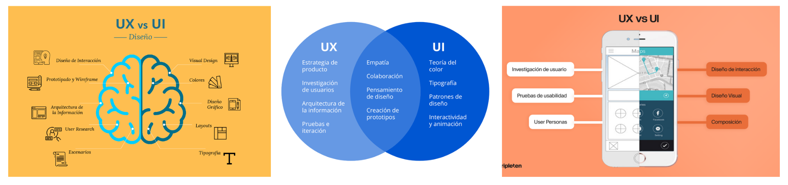
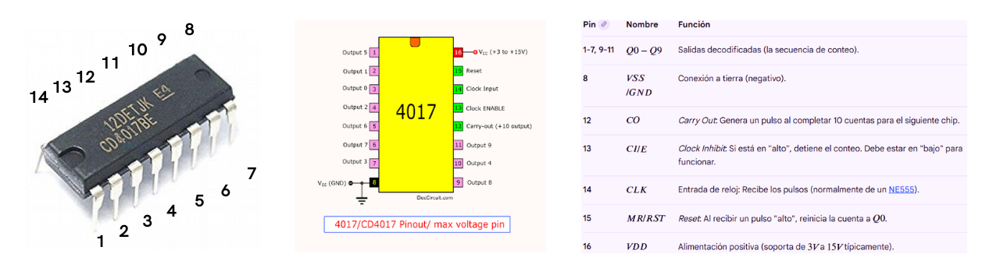
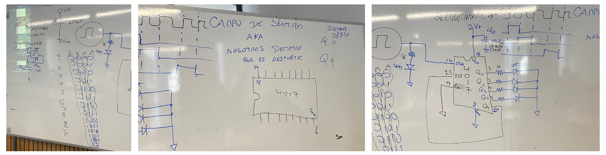
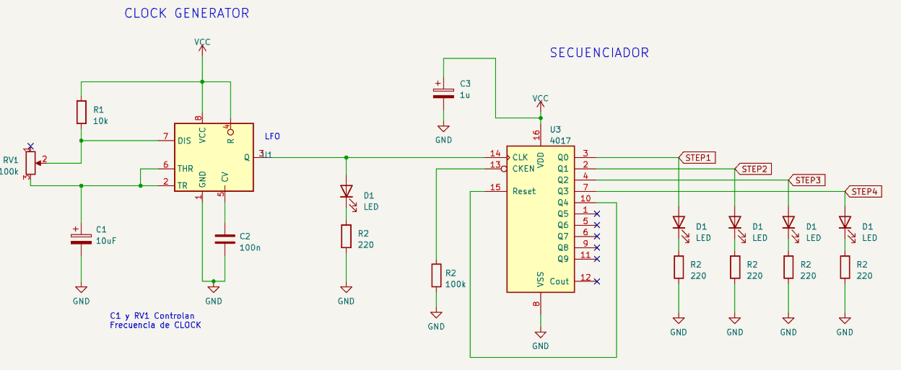
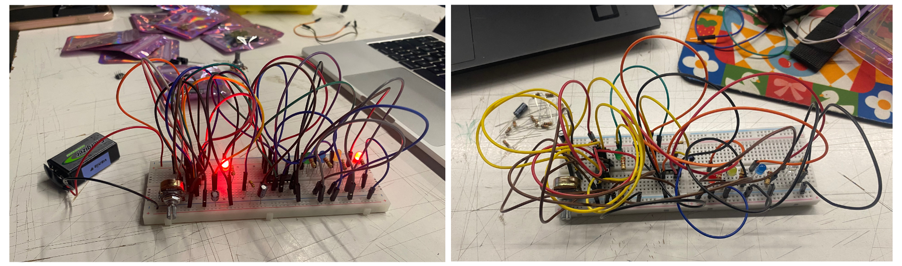

# sesion-05b

Viernes 10 de Abril, 2026. 

Nota del día: me encantó lo que hicimos esta clase !! 

## Referentes (y otras cosas)

- **David Byrne** es un prolífico músico, artista visual y cineasta escocés-estadounidense, mundialmente reconocido como el líder y principal compositor de la banda de new wave Talking Heads. Actualmente, a sus 73 años, Byrne atraviesa una etapa de intensa actividad creativa marcada por el lanzamiento de su álbum Who Is The Sky? (2025) y una extensa gira mundial que se prolonga hasta julio de 2026. 
- **Talking heads** fueron una de las bandas más influyentes y aclamadas por la crítica de la era post-punk y new wave. Formados en Nueva York en 1975, rompieron moldes al combinar rock, funk, ritmos africanos y letras artísticas y minimalistas. De talking heads, "Stop Making Sense" es considerada por muchos como la mejor película de concierto de la historia, dirigida por Jonathan Demme (quien luego dirigió El silencio de los inocentes). En 2023 y 2024, la película fue restaurada en 4K y reestrenada en cines de todo el mundo, lo que provocó que los cuatro miembros volvieran a aparecer juntos en público por primera vez en décadas para entrevistas.
- **St. Vincent**, Annie Clark, conocida profesionalmente como St. Vincent, es una de las artistas más innovadoras y virtuosas de la música alternativa actual. Es famosa por su habilidad técnica con la guitarra, su estética camaleónica y su capacidad para fusionar el pop artístico con el rock experimental. 
- **St. Vincent guitar**: Annie quería una guitarra que no solo fuera estéticamente única, sino que resolviera problemas ergonómicos que las guitarras estándar presentan para muchos músicos. Es extremadamente ligera y equilibrada. Annie mencionó que la diseñó pensando en la anatomía femenina, dejando espacio para el pecho y evitando que el cuerpo de la guitarra fuera demasiado voluminoso. - <https://www.music-man.com/instruments/guitars/st-vincent>

## Qué aprendí hoy

Considerar: para la solemne usar cartón para la carcasa (caja). 

### UX (User Experience)

Se enfoca en la sensación general y la utilidad.

El diseño de la experiencia de usuario es un proceso estratégico que busca entender el "porqué" detrás del uso de un producto. No se trata solo de que algo funcione, sino de que la interacción sea fluida, lógica y satisfactoria. Un diseñador UX investiga el comportamiento humano, identifica puntos de fricción y diseña soluciones que reduzcan el esfuerzo cognitivo del usuario. Su meta es alinear las necesidades del negocio con las necesidades reales de las personas.

- **User Research:** Realización de entrevistas, encuestas y pruebas de guerrilla para obtener datos reales.
- **User Personas:** Creación de perfiles ficticios que representan a los diferentes tipos de usuarios finales.
- **Customer Journey Map:** Visualización de todas las etapas que recorre el usuario al interactuar con el servicio.
- **Arquitectura de Información:** Clasificación y jerarquización del contenido para que sea fácil de encontrar.
- **User Flows:** Diagramas que muestran las rutas lógicas que sigue el usuario dentro de una aplicación.
- **Pruebas de Usabilidad:** Evaluar con usuarios reales si el diseño actual resuelve sus problemas de manera eficiente.

La idea es empezar a pensar no solo en que funcione, sino en cómo se usa:

- Qué controla el usuario.
- Qué tan intuitivo es.
- Cómo se entiende la interacción.

### UI (User Interface)

Se concentra en los elementos visuales e interactivos que permiten esa experiencia.

El diseño de interfaz es la parte tangible y visual de la experiencia. Se encarga de transformar los flujos y estructuras del UX en una interfaz estética, funcional y emocionalmente atractiva. El UI se enfoca en la consistencia visual y en guiar al usuario mediante señales visuales claras, como el contraste, la tipografía y el color. Es el puente visual que comunica la marca y facilita que el usuario sepa exactamente dónde hacer clic o cómo avanzar.

- **Sistemas de Diseño (Design Systems):** Creación de una biblioteca de componentes reutilizables (botones, tarjetas, inputs).
- **Teoría del Color:** Uso psicológico y técnico del color para transmitir emociones y jerarquizar información.
- **Tipografía:** Selección de fuentes que aseguren legibilidad en diferentes tamaños y dispositivos.
- **Responsive Design:** Adaptación visual de la interfaz para que luzca perfecta en móviles, tablets y computadoras.
- **Microinteracciones:** Animaciones sutiles que dan feedback al usuario (ej: un botón que cambia de color al presionarlo).
- **Accesibilidad Visual:** Garantizar que los contrastes y elementos sean legibles para personas con discapacidades visuales.

### Chip 4017 

Circuito integrado CMOS de 16 pines que funciona como contador/divisor de décadas (hasta 10). Activa secuencialmente una de sus 10 salidas (Q0-Q9) con cada pulso de reloj positivo recibido en el pin 14. Funciona con voltajes de 3V a 15V (o hasta 18V según), siendo ideal para secuenciadores de luces.

"Secuenciadores"
- Un secuenciador va activando salidas una por una, siguiendo un orden, lo que permite generar patrones (por ejemplo, luces o sonido).

Es decir:

- Llega un pulso y se activa Q0.
- Llega otro y se activa Q1.
- Después Q2.
- Y así hasta Q9, luego vuelve a empezar.
- En el fondo, “va contando” y distribuyendo la señal.

Pines importantes:

- **CLK (clock):** donde entra el pulso
- **CI (clock inhibit):** detiene el conteo si está activado
- **MR (reset):** vuelve todo a la salida inicial
- **VCC / GND:** alimentación
- **CI (Clock Inhibitor)**: si está en alto, el contador se pausa.

Cada salida se activa en orden, generando una especie de recorrido.

Esto se puede usar para:

- Prender LEDs en secuencia.
- Generar ritmos.
- Activar distintos módulos.

### Clock / Reloj

Para que el 4017 funcione, necesita un clock (reloj), que es una señal que marca el ritmo.

Este reloj se puede hacer con:

- Chip 555
- Chip 4093

El clock define la velocidad de todo: mientras más rápido, más rápido avanza la secuencia.

ej: Para que un chip 4017 cambie de una luz a otra, necesita una señal cuadrada en su pin 14. El 555 genera esta señal automáticamente cuando se configura en modo astable. 

## Qué hice hoy

Hicimos un circuito secuenciador donde los LEDs se iban prendiendo en distintos tiempos según el clock - uso chip 4017. 
En mi caso estoy muy feliz porque es primera vez que puedo seguir el esquema yo sola y me funcionó a la primera !! no me equivoque en nada y me encantó el resultado, lo único es que tengo que seguir mejorando respecto al uso de cables y el orden de todos los componentes. 

Pizarra clase:

Circuito: 

Comparación vania (bien ordenado) y el mío (desorden, estoy mejorando !!): 

Todos los circuitos del grupo funcionando al mismo tiempoo: (nico, vania y yo) (no sabíamos que había que hacer solo uno grupal así que cada uno lo hizo de forma separada, después aarón nos dijo jssjjsjs, nos preguntó si estabamos peliados por no hacerlo juntos) 

