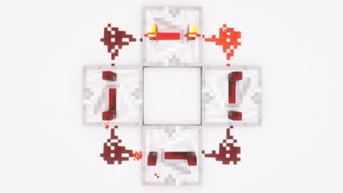

# sesion-06a

## apuntes martes 14 de abril

* La clase empezó mostrando algunos referentes para después explicar cómo funciona el 4093. El objetivo de esta clase era armar el 555, 4017 y 4093 para la próxima, terminar todo el circuito.
* **Schmitt Trigger** = comparador, como el de Minecraft; yo lo entendí como si fuera una señal y otra señal, pongámosle señal 1 y señal 2, la señal 2 está en 0 y mientras la señal 1 va aumentando su cantidad y tras traspasar un umbral activa la señal 2, activándola y poniéndola en 1.
* **Chip 4093** =  (comúnmente CD4093) es un circuito integrado CMOS que contiene cuatro compuertas NAND de dos entradas, cada una con una función de disparador Schmitt (Schmitt Trigger) integrada en sus entradas.
* Compuerta NAND = Produce una salida en estado bajo (0) solo si todas sus entradas están en estado alto (1). Si alguna entrada es 0, la salida será 1.
* CHIP 4017 = Es un contador de décadas o igual me gusta compararlo cuando uno quería hacer un flujo de energía continuo de redstone en Minecraft.

* Junto a nuestro grupo logramos hacer que funcionara hasta el final. Lo único extraño que había sucedido fue que un LED no parpadeaba como los otros y eso dependía de los potenciómetros; si se movían casi todos a la derecha, hacía que este casi que dejara de parpadear. Le preguntamos a misa y no supo qué ocurría, pero en sí el 4093 sí cumplía su función de cambiar los tonos.

---

## experimentación en casa
* Trataré de armar hasta donde me den los componentes para realizar este proyecto, espero que con un protoboard chico y uno largo me alcance para todo.  
* Después de un intento fallido, logré hacer funcionar el 555 sin problemas.

* Luego hice el 4017 y logré armarlo sin problema con el 555. Cambié el potenciómetro del 555 por un LDR porque me faltan potenciómetros.
 

* Viendo la ortografía y apuntes que me faltaron abordar junto a los gif, no me di cuenta de que dejé el 4017 junto al 555 encendidos a la batería, por lo que ya no le debe de quedar mucha D:.

  

