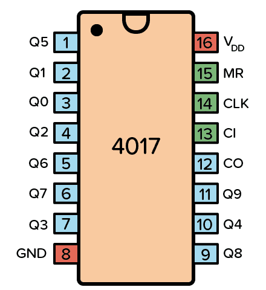

# sesion-05b

En esta clase vimos sistemas en los que las acciones ocurren de forma progresiva, siguiendo un orden en el tiempo. 

Un secuenciador permite que una señal avance paso a paso, activando distintas salidas una por una. De esta forma, la señal no actúa de golpe, sino que se va desplazando por etapas, lo que permite generar patrones como luces o ritmos.

---

### Clock 

- Es la señal que marca el ritmo.
- Cada pulso = un paso.
- Puede hacerse con 555 o 4093.

---

### Chip 4017

Cuando le llega un pulso (desde el clock), cambia la salida activa:

Parte en Q0, luego pasa a Q1, después Q2, y así sucesivamente hasta Q9.
Después de la última, vuelve a empezar desde el principio, formando un ciclo continuo.
- Solo una salida está activa a la vez, lo que hace que la secuencia sea clara y ordenada.
  
### Entradas

- CLK (Clock): hace avanzar la secuencia
- CI: pausa el conteo
- MR: reinicia desde el inicio
  
### Salidas

- Q0 a Q9: se activan una por una
  
### Alimentación

- VCC / GND

### Ejercicio en clases; Clock Generator

Realicé el  ejercicio junto a Benjamín Álvarez, que consistía en construir un circuito secuenciador donde varios LEDs se encendían en distintos tiempos, uno después del otro, en lugar de prenderse todos al mismo tiempo.

Al principio no funcionó e intentamos todo lo que Misa nos decía que podía ser el problema, pero no pasaba nada, y para variar, era solo que el chip estaba malo ˙𐃷˙

Mi primer gif en taller wuoooo 

---

### Diseño de interfaz

Al crear una interfaz, hay que pensar en cómo las personas la entienden y la usan, no solo en que funcione.

### Campo de sentido

Tiene que ver con lo aesthetic: cómo se ve y se siente la interfaz, y cómo se percibe a nivel visual y sensorial.

### Ejercicio

Consiste en hacer una interfaz física usando cajas de cartón.
