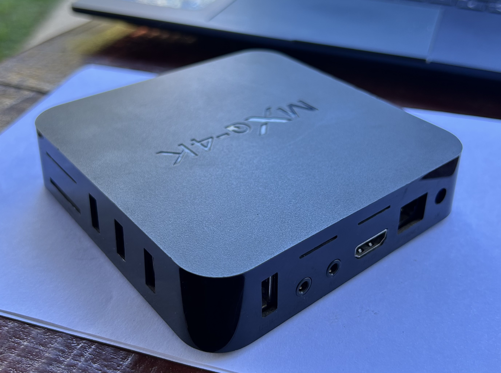
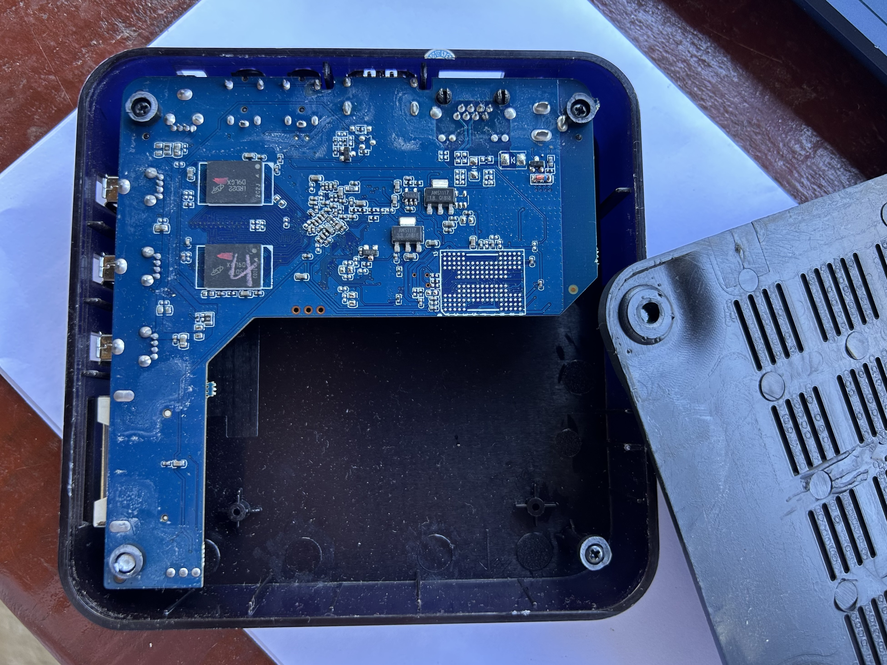
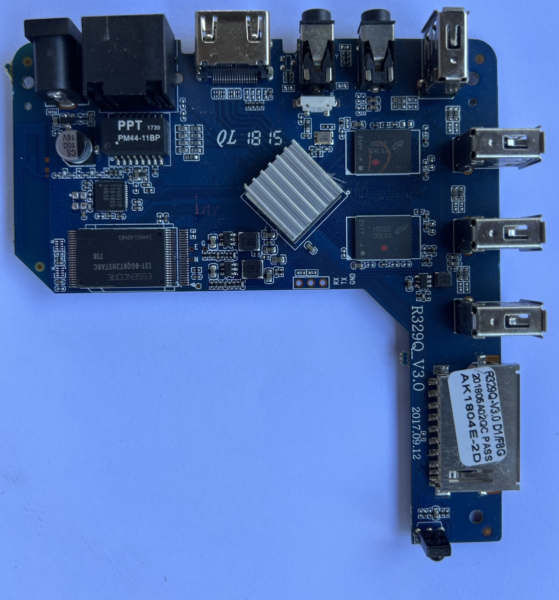
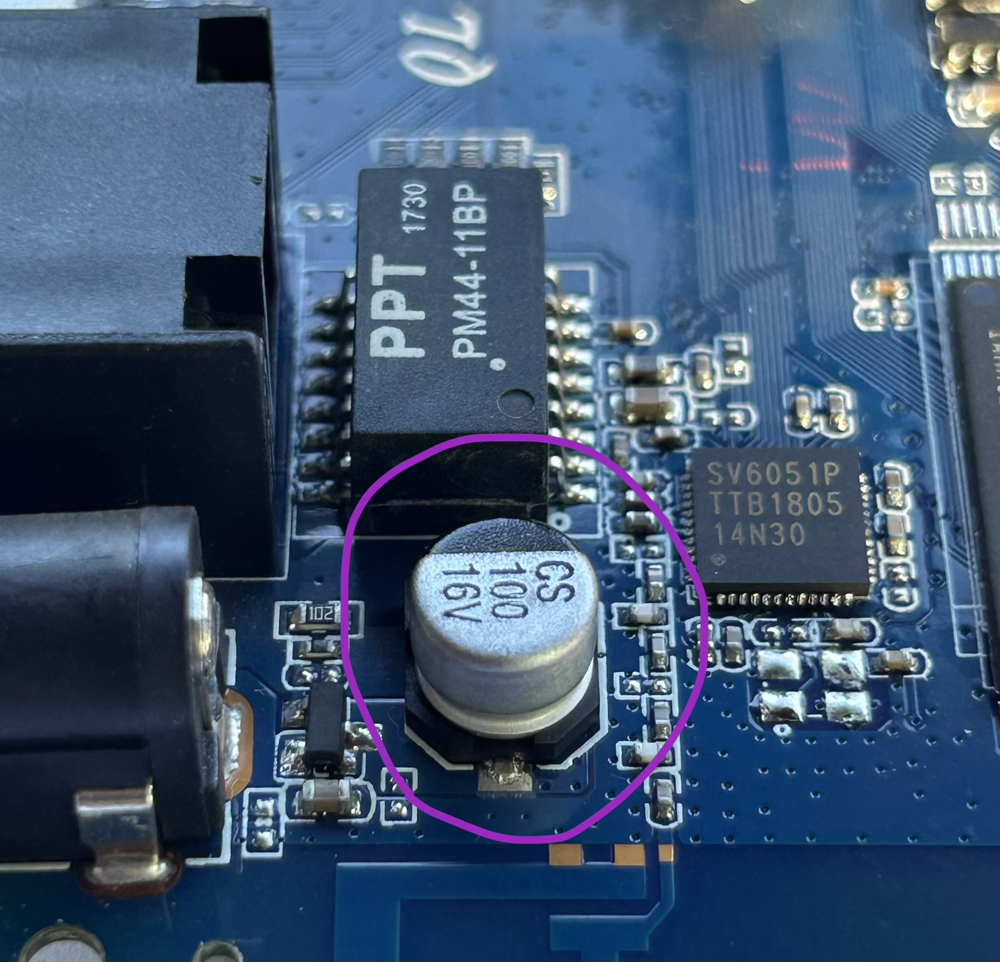
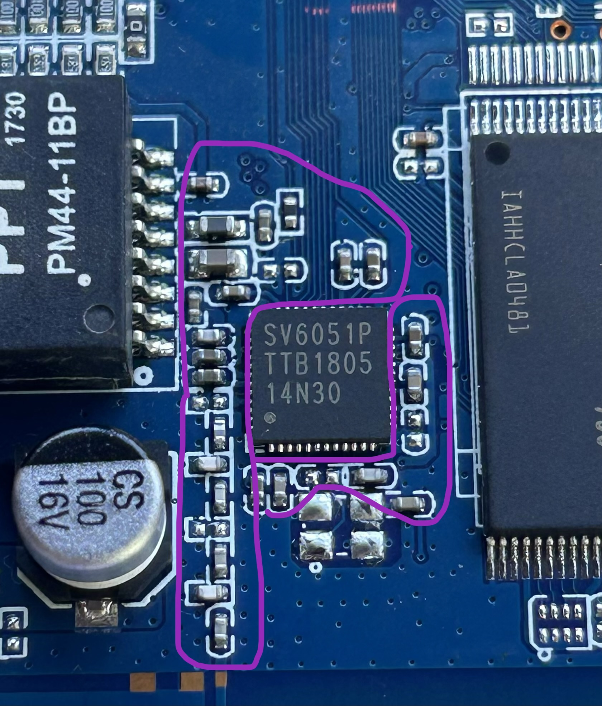
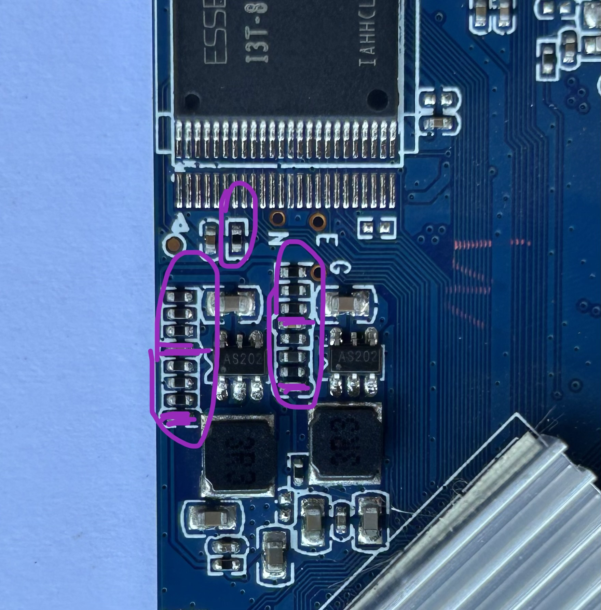
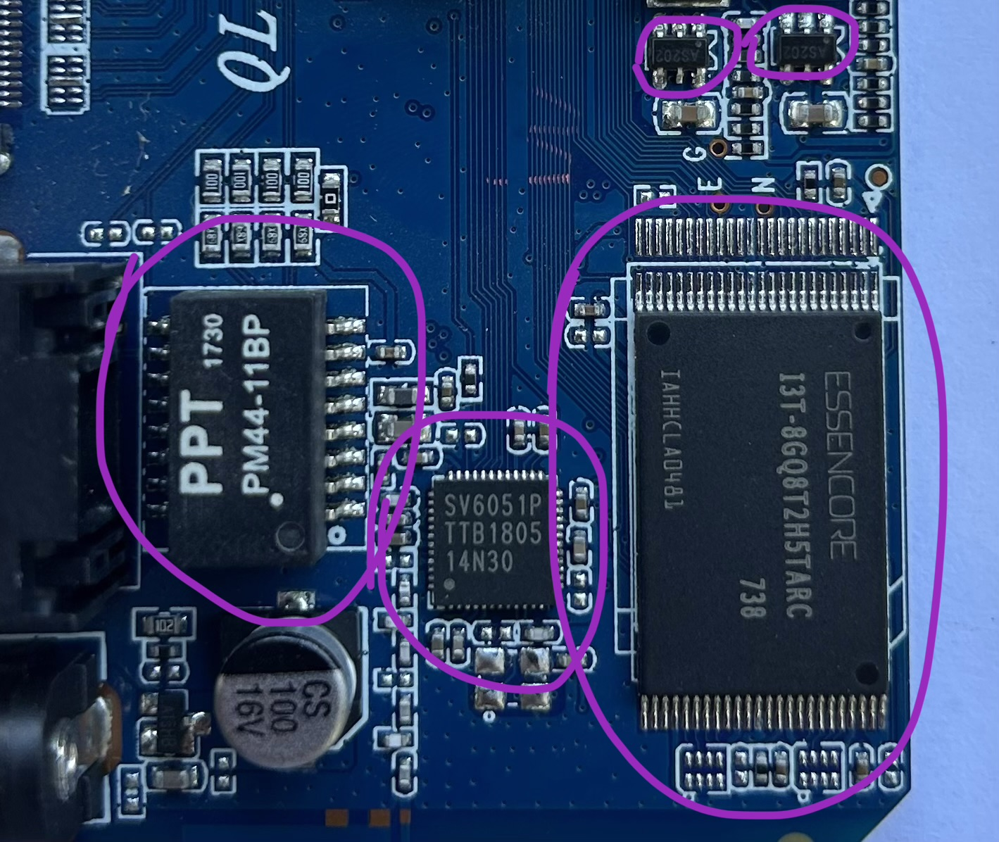
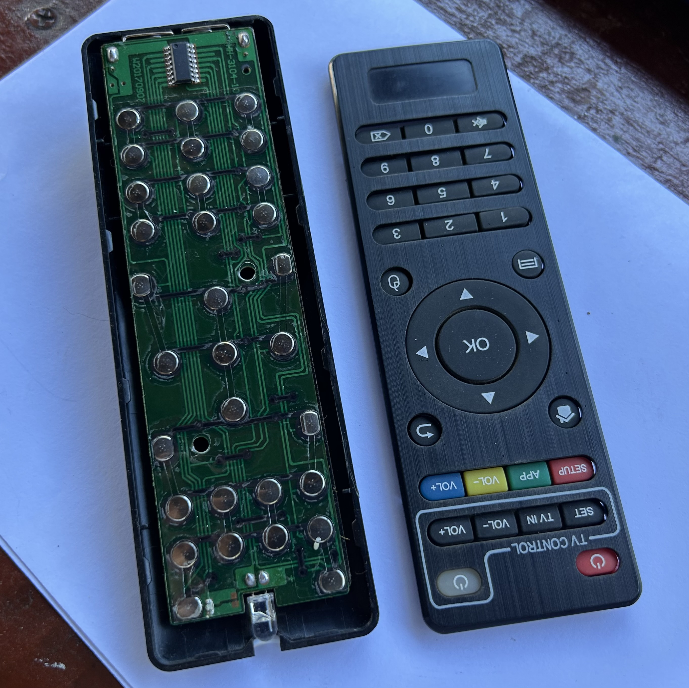
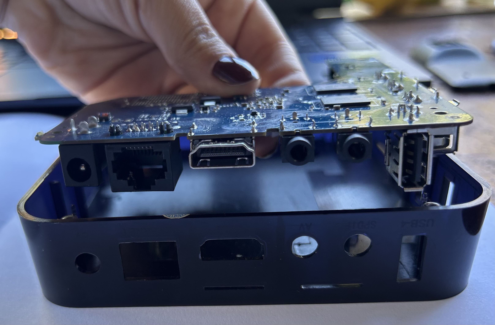
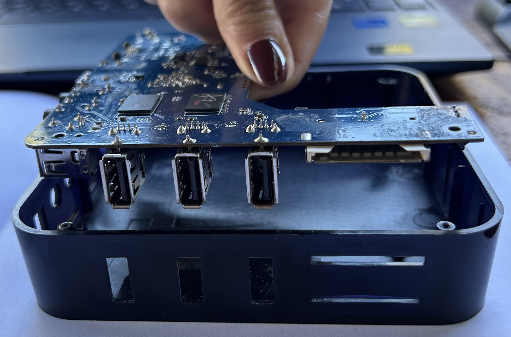

# sesion-04a

No fui :(

Pero mis amiguis me compartieron sus apuntes y me comentaron lo visto en clases <3 

## Apuntes clase 

+ Izquierda: entrada 
+ Centro: alineación 
+ Derecha: salida 

Resistencias: se encuentran resistencias en mega → se miden en Ω 

10¹² → 1.000.000.000.000 → tera 

10⁹ → 1.000.000.000 → giga 

10⁶ → 1.000.000 → mega 

10³ → 1.000 → kilo 

10⁰ → 1 → unidad 

Condensadores 

10⁻³ → 0.001 → mili 

10⁻⁶ → 0.000001 → micro (µ) 

10⁻⁹ → 0.000000001 → nano 

10⁻¹² → 0.000000000001 → pico 

104 = 100000 

→ 100 nF 

→ 0,1 µF 

“Faraday” se asocia casi siempre con el faradio (símbolo: F). Es la unidad que mide la capacitancia, es decir, la capacidad de un componente (el capacitor o condensador) para almacenar carga eléctrica. 

Condensador 471 = 470 pF 
= 0,47 nF 

FALSTAD: sirve para hacer simulaciones (falstad.com) 

+ Clic derecho para agregar cosas 
+ Tecla Escape para mover elementos
+ Puntitos: conexión entre cables
→ Rojos: NO conexión

El ejercicio que se realizó fue conectar un circuito astable y uno monoestable. 

____

# Encargo: Destripar dispositivo electrónico 

## TV Box

Abrir la TV Box con cuidado. 

Reconocer la PCB y retirar los tornillos para poder sacarla y analizarla.

Analizar y reconocer chips, condensadores y resistencias. 

### ¡Qué vi!

+ Condensador electrolítico: solo vi uno (CS 100 16V); destacaba porque es redondo y sobresale.

+ Condensadores cerámicos: hay demasiados. Intenté contarlos, pero perdía la cuenta. Para reconocerlos, me fijé en que fueran pequeños rectángulos, con una franja de color café, beige o gris, y que no tienen números.

+ Resistencias: también hay muchas. Son similares a los capacitores, pero de color negro o café oscuro, y estas sí tienen números, aunque no todas, ya que algunas son muy pequeñas.

+ Chips: hay de distintos tamaños y formas. Logré reconocer 6, principalmente fijándome en sus patitas.

Y como extra, investigué un poco sobre otros elementos que iba viendo y que llamaban mi atención: un diodo, transistores, RAM, puertos USB y HDMI, un cristal oscilador de 24 MHz y un jack DC. 

También, como extra, abrí el control de la TV Box, pero no fue mucho lo que pude reconocer: solo un chip y un LED. 

### Conexiones entre la PCB y la carcasa 

### Texto poético

En el cuerpo de la TV Box existen muchos organismos que velan por su funcionamiento, ayudando a que este ser cobre vida y pueda realizar sus tareas correctamente. En lo más profundo se encuentra el más importante de todos: el cerebro, el procesador, quien dirige cada impulso como si fueran pensamientos, guiando los nervios de este organismo invisible. Gracias a él, todo comienza a fluir, despertando poco a poco a los demás, como un cuerpo que abre los ojos y siente cómo la vida recorre su interior. 

Entonces despiertan los condensadores, latiendo con melodías de cargas altas y bajas en un ritmo constante, mientras las resistencias se interponen suavemente, restringiendo el paso de la corriente como si regularan su intensidad. En este mismo cuerpo habitan los chips, órganos distribuidos estratégicamente, cada uno cumpliendo su función en silencio. A través de todos ellos, la corriente fluye como sangre, recorriendo venas luminosas, transportando energía y llevando vida a cada rincón del organismo, respondiendo a las señales del entorno como si fueran estímulos que dan forma a su existencia. 

Finalmente, toda esta energía procesada se dirige hacia sus manos, los puertos USB, siempre listas para recibir y entregar información, como si estrecharan manos con otros seres al conectarse. Y junto a ellos se encuentra el nervio principal, el HDMI, la vía directa entre el pensamiento y la visión. A través de él fluyen las imágenes y los sonidos, cruzando hacia el exterior sin perder su forma, logrando proyectar sus pensamientos al mundo. Así, este cuerpo electrónico no solo funciona, sino que se expresa, como si en su interior habitara algo más que simple energía. 

 
