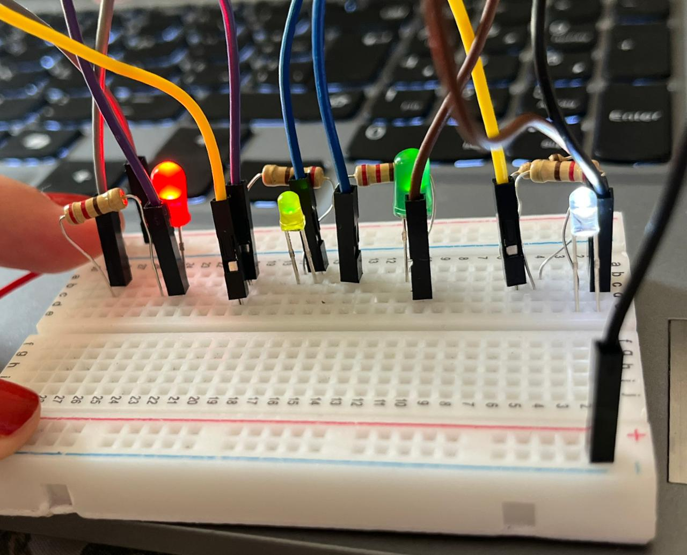
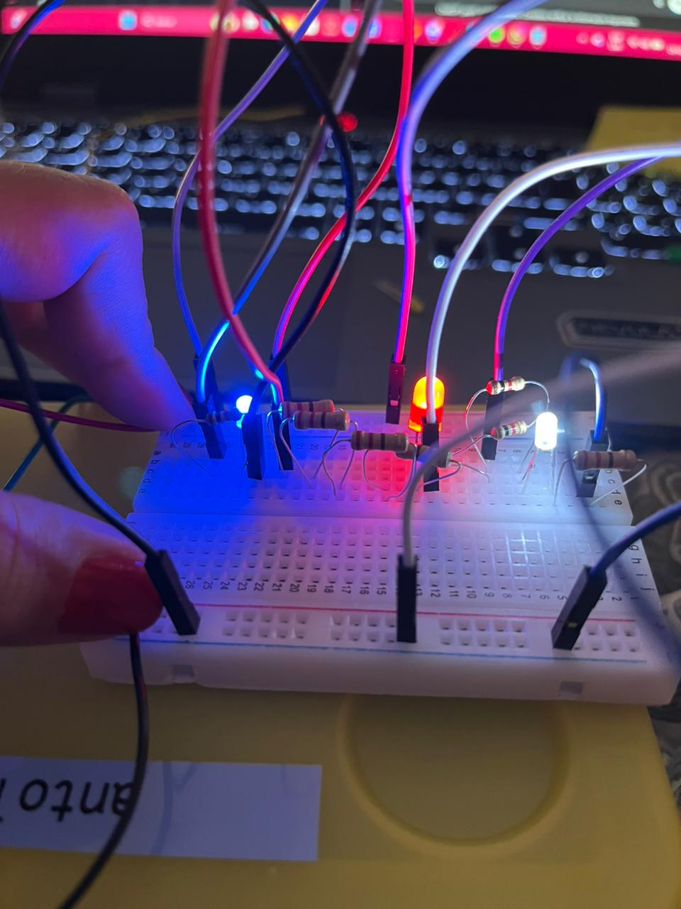
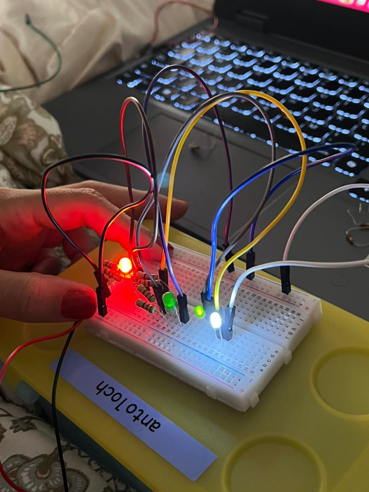
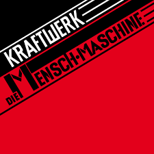
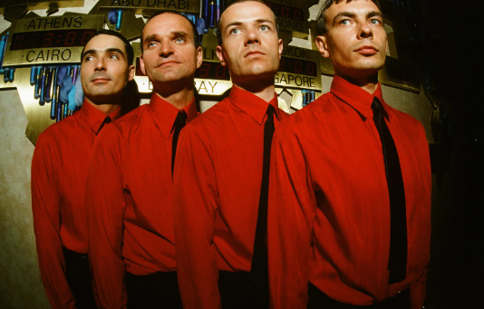
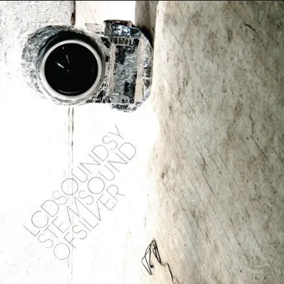
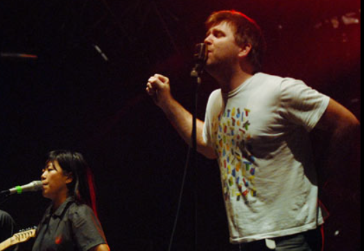

# sesion-02a
# Pierre Schaeffer 

- El sonido se estudia como un objeto
- No importa de dónde viene, sino cómo se escucha
- Base de la música concreta

# Entrega de herramientas
nos entregaron cajas con varias herramientas, que usaremos siempre:

## Potenciómetro
- Sirve para regular
- Hay muchos tipos
- Ej: B100K

## Conectores
- Cables dupont
- Caimán
- Usar colores para:
  - ordenar
  - poder leer con claridad

## Parlantes
- Generan sonido desde la electricidad
  

## Chips (ej: CD4017BE)

- Son simétricos
- Tienen las mismas patas a cada lado
- Se ponen:
  - un lado a un lado del protoboard
  - el otro al otro lado

Sirven para:
- contar
- hacer secuencias

## Broche de batería
- Conecta la batería al circuito

## Spectrum visible light
- Es el espectro de luz visible

# Resistencia eléctrica
Un material se opone al paso de la electricidad

- Cable más largo → más resistencia
- Más chico el área → más resistencia
- Más grande el área → menos resistencia

## importante

Todo material se resiste

No existe (normalmente) resistencia 0

- Cobre conductor → resistencia aprox: 0,075
- Carbón → resistencia: 100 – 1000

---

## Ejemplo para entender

Electricidad = agua  
Material = tubo  

- Tubo ancho → pasa fácil → poca resistencia  
- Tubo angosto → cuesta → mucha resistencia  

Siempre hay algo de resistencia

---

## Clasificación

### Conductores
- Hierro
- Plata
- Oro
- Cobre
- Aluminio
- Aire (pero en ciertas situaciones)

### Aislantes
- Vidrio
- Tierra
- Plástico
- Madera
- Cuero

Importante:  
No es que unos conducen y otros no,  
sino que unos resisten poco y otros resisten mucho

## Datito

- El cuerpo humano tiene resistencia
- El aire puede conducir electricidad en ciertas condiciones (como los rayos)

# Ley de Ohm

V = I × R  
I = V / R  

# Código de color de resistencia

DORADO = TOLERANCIA (5%)

## Cómo leer una resistencia

- Primer color → primer número  
- Segundo color → segundo número  
- Tercer color → cantidad de ceros  
- Cuarto color → tolerancia  

## Ejemplo 

### Rojo – Rojo – Café – Dorado

- Rojo = 2  
- Rojo = 2  
- Café = 1 cero  
- Dorado = 5%  

Resultado: 22 + 1 cero → 220 Ω

### Café – Negro – Rojo – Dorado

- Café = 1  
- Negro = 0  
- Rojo = 2 ceros  
- Dorado = 5%  

Resultado: 10 + 2 ceros → 1.000 Ω (1kΩ)

### Amarillo – Violeta – Naranjo – Dorado

- Amarillo = 4  
- Violeta = 7  
- Naranjo = 3 ceros  
- Dorado = 5%  

Resultado: 47 + 3 ceros → 47.000 Ω (47kΩ)

## tipicos influencers
- 1.000 = 1k  
- 10.000 = 10k  

## colores

Los colores funcionan como un código:
te dicen el número y cuántos ceros tiene la resistencia

# GitHub

Cómo agregar imágenes:

- Sin mayúsculas
- Sin espacios (usar -)

# Conceptos de circuito

## Circuito paralelo
En un circuito paralelo, la corriente tiene varios caminos, por lo que los componentes funcionan de forma independiente y el voltaje es el mismo en cada uno.
## Símbolos

- GND → Ground (tierra)
- VCC → voltaje de alimentación / corriente continua
- R → resistencia
- D → LED
- 
## Encargo-02a
  
## Circuito 1

| Resistencia que falta | D1 | D2 | D3 | D4 |
|----------------------|----|----|----|----|
| R1                   | 0  | 0  | 0  | 0  |
| R2                   | 1  | 0  | 0  | 1  |
| R3                   | 1  | 1  | 1  | 0  |
| R4                   | 1  | 1  | 1  | 0  |
| R5                   | 1  | 0  | 0  | 1  |

## Circuito 2

| Resistencia que falta | D1 | D2 | D3 |
|----------------------|----|----|----|
| R1                   | 1  | 0  | 1  |
| R2                   | 1  | 0  | 1  |
| R3                   | 1  | 0  | 1  |
| R4                   | 1  | 0  | 1  |
| R5                   | 0  | 1  | 1  |
| R6                   | 1  | 1  | 1  |
| R7                   | 1  | 1  | 1  |
| R8                   | 1  | 1  | 0  |

## Circuito 3

| Resistencia que falta | D1 | D2 | D3 | D4 |
|----------------------|----|----|----|----|
| R1                   | 1  | 0  | 0  | 0  |
| R2                   | 1  | 0  | 0  | 0  |
| R3                   | 0  | 0  | 1  | 0  |
| R4                   | 0  | 1  | 1  | 0  |
| R5                   | 0  | 1  | 1  | 1  |
| R6                   | 0  | 1  | 1  | 1  |

## The Man-Machine — Kraftwerk

  

### Creación de un lenguaje completamente único y extraño
The Man-Machine de Kraftwerk me llamo mucho la atención, porque siento que acá ya tienen totalmente claro su estilo. El disco suena súper casi mecánico, pero no tan aburrido. Es como si todo estuviera sumamente calculado: los ritmos, los sintetizadores, las voces. Canciones como “The Robots” o “The Model” son pegajosas pero igual frías, como si estuvieran hechas por robts sin emoción humana, y eso es justamente lo interesante. Es algo que no se escucha todos los días, y al ser algo completamente extraño, lo hace sumamente genial.  
 

### Contexto histórico y estético
El contexto en donde se sitúa de esta banda igual influye mucho, porque vienen de la Alemania de los 70, en Düsseldorf, con toda esta idea de modernidad, industria y tecnología. Eso se nota en el sonido y en cómo se presentan. No es solo música, es un concepto completo.  

### Presentaciones en vivo de la época
En vivo en esa época eran súper particulares. No habían expresiones, ni movimientos, tocaban como si fueran parte de una máquina o como si fueran robots. Se vestían todos iguales, con trajes y corbata. No se sabe si están tocando personales reales o robots.  

### Visuales y estética artística
Las visuales de los shows también son clave, se nota que estaban muy influenciada por la bauhaus y el constructivismo. Principalmente usan geometrías, colores simples como negro, blanco y rojo, todo limpio, estructurado, ordenado y repetitivo. Al juntar todas las características sus shows parecían mas una instalación de artistas visuales con experimentos sonoros.  

### Shows actuales y evolución tecnológica
Hoy en día sus shows son mucho más modernos, usando pantallas 3d, todo sigue siendo super sincronizado, la finalidad de esta banda sigue siendo la misma, solo que antes era más análogo por la tecnología de la época, ahora es mas digital, por la tecnología de hoy en día  

https://youtu.be/gQlM41JDTGs?si=lkZk5MWZ9BEOJJAc  

Siguen siendo lo mismo, solo se van adaptando a las nuevas tecnologías.  

---

## Sound of Silver — LCD Soundsystem
  
### Una repetición más viva y cambiante
Sound of Silver de LCD Soundsystem, y acá la sensación es totalmente distinta, la sensación no es tan de repetición “mecánica” como en Kraftwerk. Es como una repetición más viva, más cambiante, donde van entrando y saliendo cosas todo el tiempo.  

### Contexto musical y cultural (2007)
2007, en New York City, en una escena donde ya existe toda la música electrónica, entonces no están inventando el sonido, están mezclando cosas. Hay electrónica, pero también hay una mezcla entre el rock, punk, disco.  

### Sonido humano e imperfecto
Este disco suena muy humano, hay errores, hay saturación, hay momentos donde todo parece medio desordenado, pero a propósito. Me da la sensación de que quieren que suene real, no perfecto.  

Lo que más me llaama la atención es cómo usan la repetición, pero a medida que suena, se van agregando más capas, más percusiones, sintetizadores, voces, va como evolucionando a medida que avanza. Las imperfecciones humanes se notan, usando instruementos mas reales mas cotidianos, como la batería, el bajo, guitarras, eso hace que suene mas humano. no es limpio ni perfecto.  

### Contrastes emocionales
También hay harto contraste: canciones que puedes bailar, pero que al mismo tiempo tienen letras medio tristes o reflexivas. Eso me gusta porque no es solo música para fiesta.  

### Presentaciones en vivo (2007)
En vivo, en esa época había Mucha energía, gente moviéndose, James Murphy cantando de forma poco “perfecta”. Se siente más como banda de rock que como acto electrónico. Se nota que nada era super organizado, todo pasaba en el momento.  
https://youtu.be/S8oEd2btSlo?si=it-mLfuL49BAtA9N  
https://youtu.be/KqbYgoS5bY4?si=Bq_-HwcHyYltQLYHhttps://youtu.be/KqbYgoS5bY4?si=Bq_-HwcHyYltQLYH  

### Shows actuales y cambios
Comparado con shows más actuales, siguen siendo buenos en vivo, pero se nota que antes había más urgencia, más energía y más caos. Ahora está todo más armado.  
https://youtu.be/jE_73nVwFTM?si=9TjjKocDMXIaoIwA  

### Reflexión final
Lo que más me queda de este disco es que toma elementos de la música electrónica, como las repeticiones, pero los vuelve humanos, emocionales, ya que nada es perfecto. Donde Kraftwerk suena como el futuro, LCD Soundsystem suena como alguien pensando en el pasado mientras baila.

