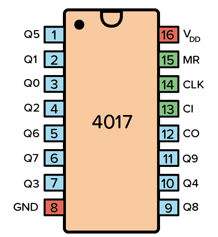
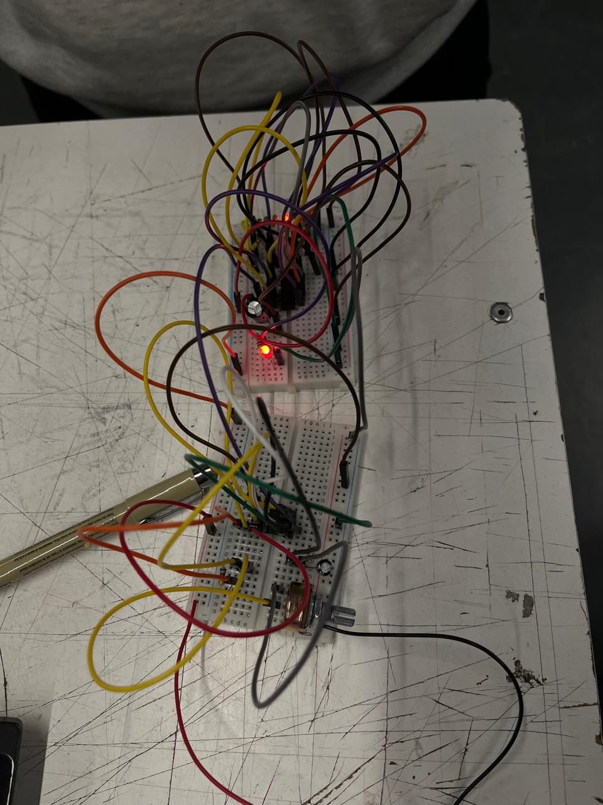
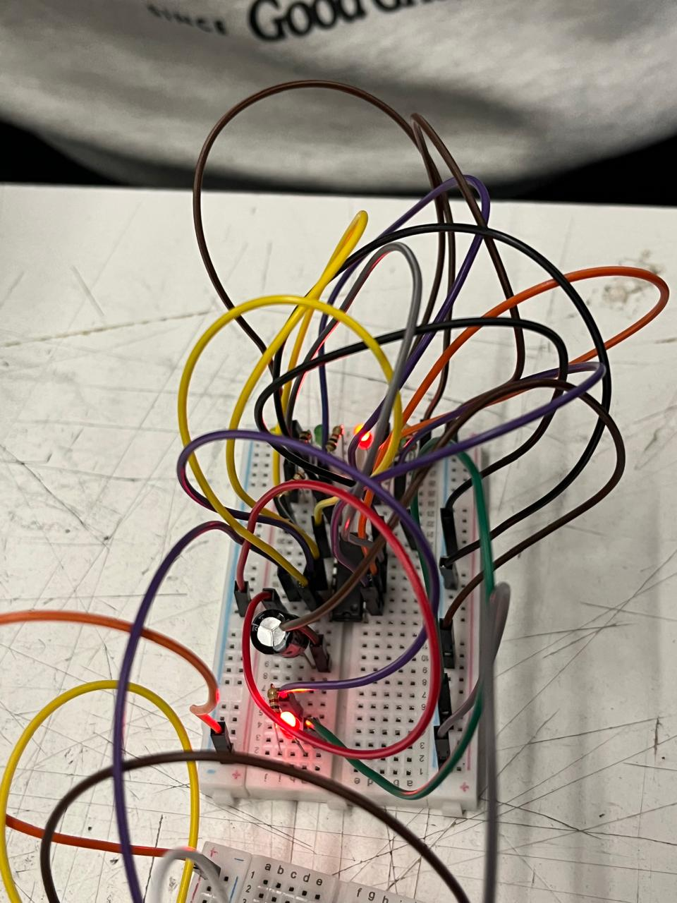

# sesion-05b

## cambio de enfoque

En esta sesión deje de pensar los circuitos solo como algo que funciona o no, yo solo me enfocaba en que encendiera o no, y no como un sistema que se use. Un circuito también es una interfaz.

¿se entiende lo que está pasando cuando alguien interactúa con el sistema?

---

## UX en sistemas electrónicos

Pensar en UX implica observar la relación entre acción y respuesta. Cuando alguien interactúa con el circuito, debería poder anticipar el resultado.

La lógica ideal es:

acción → respuesta → comprensión

Si esa relación no es clara, el sistema se vuelve confuso aunque funcione correctamente.

---

## campo de sentido

El “campo de sentido” se refiere a cómo se percibe el sistema en su conjunto. No es solo lo que hace, sino cómo se siente.

Un circuito puede percibirse como:

- ordenado o caótico  
- rápido o lento  
- claro o enredado  

Esto influye directamente en la experiencia de uso.

---

## David Byrne 

En su trabajo, Byrne explica que la música no existe aislada, sino que depende del espacio, las herramientas y las limitaciones. Lo mismo ocurre con los circuitos: su diseño define qué tipo de comportamiento es posible.

Un secuenciador, por ejemplo, no solo ejecuta una función, sino que propone una forma específica de organizar el tiempo.

---

## secuenciadores

Un secuenciador es un sistema que activa distintas salidas una tras otra siguiendo un orden.

Esto permite generar:

- patrones  
- recorridos  
- ritmos  

Más que encender cosas, organiza eventos en el tiempo.

---

## el CD4017

El CD4017 es un contador de décadas con 10 salidas (Q0 a Q9). Cada vez que recibe un pulso, activa la siguiente salida en orden.

El recorrido es secuencial y cíclico: cuando llega al final, vuelve al inicio.

Esto lo convierte en una herramienta simple para distribuir una señal en distintos pasos.

---

## el clock

El funcionamiento del 4017 depende del clock, que es una señal periódica que marca el ritmo del sistema.

Se puede generar con circuitos como:

- 555  
- 4093  

La velocidad del clock cambia completamente la percepción del sistema:

- rápido → difícil de seguir  
- lento → más claro y legible  

---

## control del sistema
El 4017 tiene pines que permiten modificar su comportamiento:

- CLK: entrada de pulsos  
- CI: pausa el conteo  
- MR: reinicia la secuencia  
- VCC / GND: alimentación  

Estos controles permiten intervenir el tiempo y la secuencia, no solo ejecutarla.

---

## trabajo en clase

## idea principal

Un secuenciador no es solo un circuito funcional. Es una herramienta para diseñar comportamiento en el tiempo.

Permite trabajar con ritmo, repetición y percepción, conectando directamente lo técnico con la experiencia de uso.
