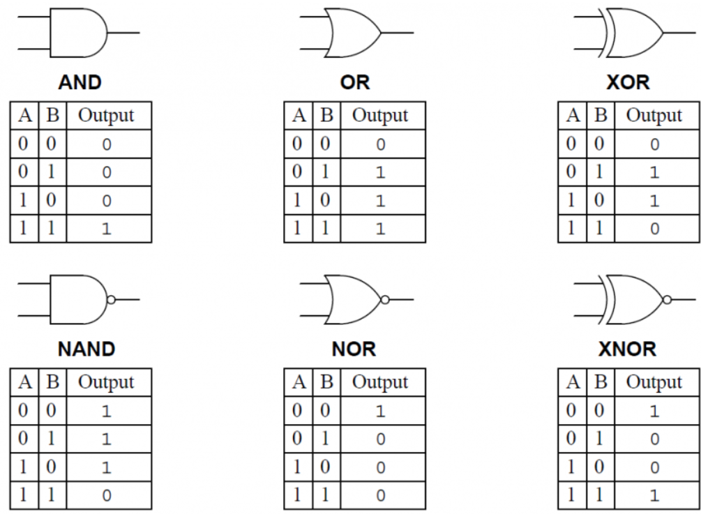

# sesion-04b

## Operadores logicos

La NAND hace siempre uno, a no ser que le den dos unos, ahí, da cero.

`Cuando x vale 0 no hay oscilación`

El condensador/capacitor ataja la velocidad (guardia del metro en la puerta)

`X siempre a 9v`

Grupo de investigación ALPACA
<https://alpaca.markets>

* Para próxima sesión: Averiguar que significa "Schmitt Trigger"

<https://andreassiagian.wordpress.com/2013/02/22/quad-oscillator-using-4093-tutorial/>
<https://andreassiagian.wordpress.com/2013/09/12/tutorial-touch-and-moist-synthesizer-using-cd4093-quad-2-input-nand-schmitt-trigger/>

Aprender cosas
<https://moritzkleininstruments.com>

## En clase

