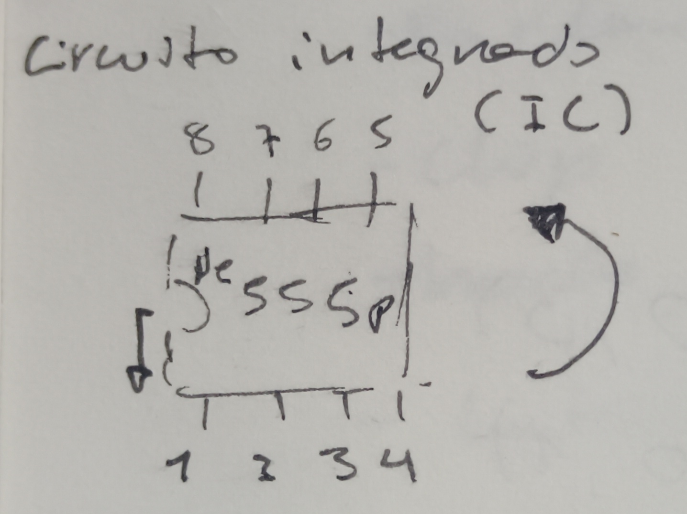

# sesion-02b

# Apuntes clase 20/03

Se nos entregó el chip NE555P, el cual es un circuito integrado (IC) que se utiliza para generar pulsos, temporizadores y oscilaciones. Éste chip tiene 8 patitas, las cuales se pueden enumerar guiándose ya sea por la dirección del texto, por el punto que puede tener el mismo texto, o por el espacio de medio círculo que tiene el chip, el cual siempre va a la izquierda. Luego de identificar el texto o el espacio que tiene el chip, se cuenta empezando desde la patita de abajo en la izquierda, continuando en sentido antihorario como se muestra en la siguiente imagen:

También se nos introdujo a los capacitores (o condensadores), en donde aprendimos que existen los capacitores electrolíticos que son polarizados, y los capacitores cerámicos que no tienen polarización. En el caso del capacitor electrolítico, se nos entregaron tres distintos:

- Capacitor 1μF, 50V
- Capacitor 10μF, 50V
- Capacitor 100μF, 50V

Mientras que en el caso de los capacitores cerámicos, se nos entregó uno que parece una lenteja, el cual tiene el número 104 escrito junto a un punto sobre el texto.

Luego de introducirnos los capacitores y el chip, nos enseñaron cómo utilizar el chip dentro de un circuito, por lo que hicimos el siguiente ejercicio:

| Letra | Significado |
| --- | --- |
| R(n) | Resistencia, el (n) es el número para poder identificarla, mientras que al lado de esto se indica de cuánto es la resistencia (1k, 10k en éste caso)|
| C(n) | Capacitor/Condensador, el (n) es el número para poder identificarlo, mientras que al lado de esto se indica de cuánto es el capacitor/condensador (10mF, 100mF en este caso)|
| D | LED |
| +9 | Positivo de la batería 9V |

Como no sabíamos como leer el circuito que nos mostraron, nos fueron guiando mientras armábamos el circuito en nuestra protoboard, en donde aprendí que los puntos que se ven entre los cables significan que se unen/encuentran. Al terminar, la protoboard se veía así:

---

### Capacitor de 10μF

El primer capacitor que conectamos fue el de 10μF, ya que ese es el que se indica en el circuito que se dibujó en la pizarra. Al momento de conectar la batería a la protoboard pensé que iba a ser inmediato el parpadeo del LED, por lo que cuando se tardó un poco en reaccionar pensé que me había equivocado, pero luego de unos pocos segundos se emepzó a comportar como se puede ver en el GIF.

---

### Capacitor de 100μF

Se nos indicó reemplazar el capacitor de 10μF por el de 100μF, y al momento de intercambiarlo volví a pensar que había hecho algo mal porque la luz del LED se mantuvo prendida por más de lo que pensé que iba a durar, pero luego entendí que solo era porque el capacitor aumentó el tiempo en el que dura encendido el LED, al igual que el tiempo de apagado.

---

### Capacitor de 1μF

Luego probamos cambiando el de 100μF al de 1μF, y al momento de conectar el capacitor de 1μF no logré notar ningún cambio en el LED a simple vista, por lo que pensé que sólo se quedaba prendida sin parpadear, pero al momento de grabarlo me di cuenta de que en la cámara del celular si se notaba como la luz se prendía y se apagaba a gran velocidad.

